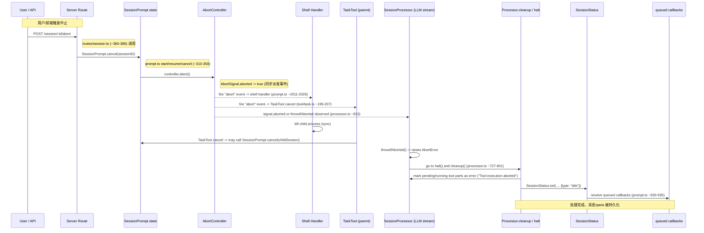

<!--
Generated: abort-signal-lifecycle
-->
# 中止信号（AbortSignal）生命周期与传输流程

本文档描述 OpenCode 仓库中会话中止信号（由 AbortController/AbortSignal 表示）的完整生命周期，包含：创建、传播、监听、触发、响应与清理。文中给出带代码引用的 Mermaid 时序图、逐步事件序列、关键代码片段位置与调试建议，方便开发者定位与复现。

> 适用范围（代码引用）:

- `packages/opencode/src/session/prompt.ts`  — `start` / `resume` / `cancel` / `loop` / shell 中止处理 (参考行 ~88–108, ~310–350, ~372–408, ~2006–2036)
- `packages/opencode/src/session/processor.ts` — `process` / `input.abort.throwIfAborted()` / `cleanup` / `halt` / `abort` (参考行 ~727–876, ~833)
- `packages/opencode/src/server/routes/session.ts` — `/session/:sessionID/abort` 路由（参考行 ~360–386）
- `packages/opencode/src/tool/task.ts` — TaskTool 在父上下文注册 abort 监听（参考行 ~199–207）
- `packages/opencode/src/util/abort.ts` — `abortAfter` / `abortAfterAny` 助手（参考行 ~11–34）

请注意：行号为文档编写时的近似位置；在不同版本中可能轻微偏移，但文件与符号均已定位。

---

## 高层摘要

- 会话（session）级中止信号由 `SessionPrompt.start(sessionID)` 创建并保存在内存 `state()` 中（`state()[sessionID].abort`），以 `AbortController` 的形式存在，外部通过 `SessionPrompt.cancel(sessionID)` 或全局清理调用 `controller.abort()` 来触发中止（prompt.ts）。
- 创建的 `AbortSignal` 会被传入到：LLM/Processor（用于流式事件处理）、工具执行上下文（Tool.Context）、Shell 命令执行、TaskTool 子任务管理等位置。各组件通过注册 `abort` 事件监听器或调用 `signal.throwIfAborted()` 来响应中止。
- 当 `abort()` 被调用：已注册的监听器立即接收 `abort` 事件（同步触发），随后运行中或等待中的流程在下一处 `throwIfAborted()` 或 Effect 中的 signal-aware 运行点中捕获并进入中止处理路径。最终 `SessionProcessor.cleanup()` 会：
  - 计算并保存残余 snapshot 的 patch（若有）
  - 终结未完成的 text/reasoning parts 并持久化
  - 将所有 pending/running 的工具部分标记为 error（并在 error 字段写入 "Tool execution aborted"）
  - 设置关联的 Assistant Message 的完成时间并更新 message

---

## Mermaid 时序图（示意）

下面的图示描述了完整的事件流，从用户/API 发起中止请求到处理器完成清理并返回的过程。图中括号内标注了与该步骤最相关的文件（及代码段）以便定位。



> 图中行号为生成本文时的参照，便于快速跳转到实现处。

---

## 逐步事件序列（文本 + 关键代码摘录）

以下列出了 abort 信号的关键步骤，并给出与之对应的代码引用与简短摘录，便于快速理解与定位。

1) 会话中止控制器的创建

- 位置: `packages/opencode/src/session/prompt.ts`
- 参考: `start(sessionID)`（约行 310–319）
- 摘录:

```ts
const controller = new AbortController()
s[sessionID] = { abort: controller, callbacks: [] }
return controller.signal
```

2) 将 signal 注入子系统

- `SessionProcessor.create()` 接受 `abort: AbortSignal` 并把它保存在 ProcessorContext 中（processor.ts ~298–312）。
- 在构建工具上下文时，`resolveTools()` 会将 `options.abortSignal` 传入每个 `Tool.Context`（prompt.ts ~967–976）。

3) 外部/用户触发中止

- HTTP 路由: `POST /session/:sessionID/abort` -> `SessionPrompt.cancel(sessionID)`（`packages/opencode/src/server/routes/session.ts` ~360–386）。
- `SessionPrompt.cancel` 的实现会：

```ts
const match = state()[sessionID]
if (!match) { await SessionStatus.set(sessionID,{type:'idle'}); return }
match.abort.abort()
delete state()[sessionID]
await SessionStatus.set(sessionID,{type:'idle'})
```

4) 注册的监听器与同步事件触发

- 任何先前注册了 `abort` 事件监听器的组件会在 `abort()` 调用时立即执行：
  - Shell（prompt.ts ~2011–2026）: 注册 `abortHandler` 使用 `kill()` 终止子进程。
  - TaskTool（tool/task.ts ~201–207）: 注册 `ctx.abort.addEventListener('abort', cancel)`，cancel 调用 `SessionPrompt.cancel(childSession)`。

5) Processor 中止检查与异常路径

- Processor 在每个流事件处理前调用 `input.abort.throwIfAborted()`（processor.ts ~833）。当 signal 表示已中止时，`throwIfAborted()` 抛出异常，Effect 的异常处理会把这个中断归类并调用 `halt()` 与 `cleanup()`（processor.ts ~860–866）。

6) cleanup 的工作（processor.ts ~727–778）

- `cleanup()` 会：
  - 计算并持久化 snapshot 补丁（若存在）
  - 完成并持久化未完成的 text/reasoning parts
  - 将未完成的 tool parts 标记为 error，并写入 error 信息（"Tool execution aborted"）
  - 设置 assistant message 的完成时间并更新

示例片段（标注错误）:

```ts
for (const part of parts) {
  if (part.type !== 'tool' || part.state.status === 'completed' || part.state.status === 'error') continue
  yield* session.updatePart({
	...part,
	state: { ...part.state, status: 'error', error: 'Tool execution aborted', time: { start: Date.now(), end: Date.now() } }
  })
}
```

7) 会话结束与回调分发（prompt.ts ~924–936）

- `loop()` 退出后，会收集等��的回调（`state()[sessionID].callbacks`）并对它们 `resolve(item)`，随后返回第一条非用户消息作为结果。

---

## 调试与验证清单

以下为重现、观察与单元测试建议。

1) 手动复现步骤

  a. 启动一个会话（通过 POST /session/:id/message 或命令行）并触发一个会导致长时间运行或流式输出的操作（例如工具执行或 LLM 长流）。
  b. 在操作进行中，调用 `POST /session/:id/abort`。
  c. 观察以下点：
	- 日志中是否记录 `cancel` 触发（`session.prompt` 的 log，prompt.ts ~340）
	- 是否触发 shell 的 `kill`（prompt.ts ~2011–2026）
	- `SessionProcessor` 是否进入 `halt()`/`cleanup()` 路径（processor.ts ~787–801, ~727–778）
	- 未完成的 tool parts 是否被标记为 error，且 error 字段包含 `Tool execution aborted`
	- 会话状态是否变为 `idle`（SessionStatus）

2) 关键日志条目（建议在日志中搜索）

  - `session.prompt` / `cancel` 相关日志（prompt.ts）
  - `session.processor` / `process` / `halt` / `cleanup` 相关日志（processor.ts）
  - tool.execute.before / tool.execute.after 插件钩子日志（resolveTools）

3) 推荐单元/集成测试

  - 单元：在 `test/session` 下添加一个测试，启动 processor with an artificial llm.stream that yields slow events, then call `SessionPrompt.cancel(session.id)` and assert that:
	- processor finished via abort path and returned 'stop'
	- parts that were running were marked error with message containing "aborted" or "Tool execution aborted"
  - 集成：构造一个 test that executes `SessionPrompt.shell()` with a long-running command and, while running, call `SessionPrompt.cancel(sessionID)`; assert child process killed and part updated.

4) 常见陷阱

  - **监听器遗漏**：若某个工具/子系统没有注册 `abort` listener 且也不在流处理点调用 `throwIfAborted()`，它可能不会立即终止；确保长运行操作能观察 `AbortSignal` 或被 shell handler/killer 覆盖。
  - **Race 条件**：`abort()` 会同步 dispatch 事件，但若代码在不同 tick 中才检查 `signal.aborted`，可能会出现短暂延迟。使用 `throwIfAborted()` 或注册监听器能提供更及时的响应。
  - **资源清理**：`cleanup()` 负责将残留的 snapshot/parts 处理干净；任意新添加的执行路径需确保在中止时也走 cleanup 路径或在 finally/ensuring 中进行清理。

---

## 参考（快速跳转）

- `packages/opencode/src/session/prompt.ts` — start/resume/cancel/loop/shell handlers
- `packages/opencode/src/session/processor.ts` — process / input.abort.throwIfAborted() / cleanup / halt
- `packages/opencode/src/server/routes/session.ts` — session abort route
- `packages/opencode/src/tool/task.ts` — TaskTool cancel listener
- `packages/opencode/src/util/abort.ts` — abortAfter / abortAfterAny helpers

---

如果你希望我：

- 把这份文档以英文/中英双语的形式保存（我可以添加英文翻译）
- 将一张更详细（包含代码片段并高亮）的 Mermaid 图插入到 docs/ 并在 README 中链接
- 或者直接添加一个集成测试用例（如上建议）并运行 CI，本地验证

请在下一步选择我所要继续执行的动作。感谢！


