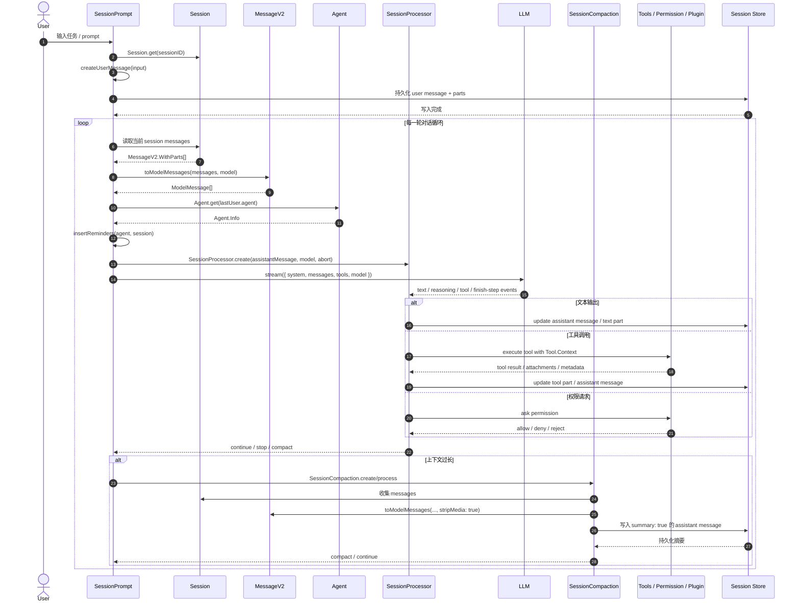
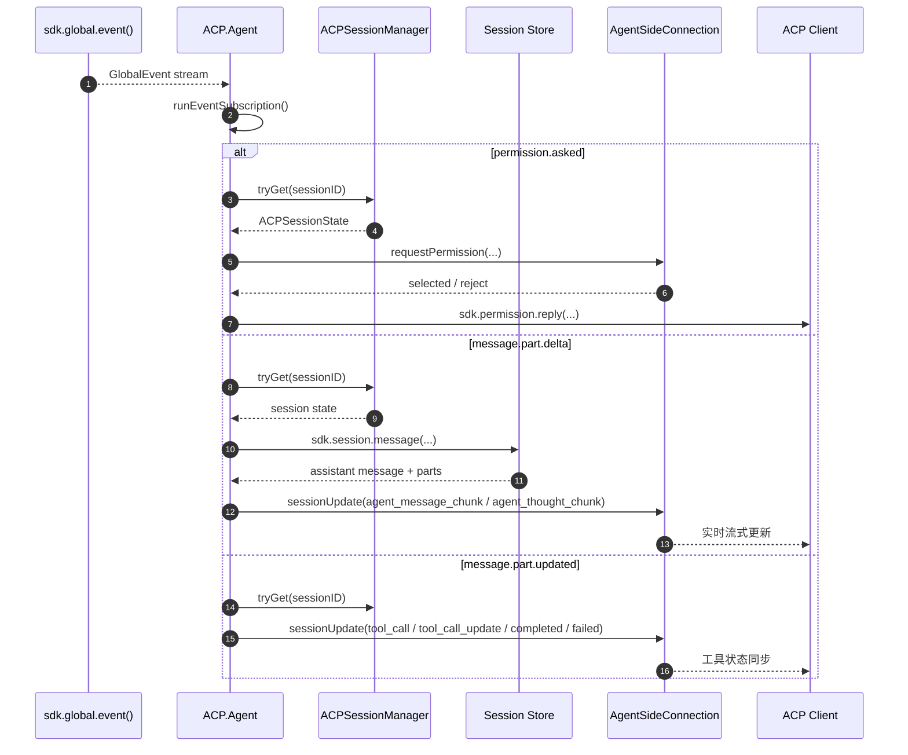

# Agent / Session / Memory / ACP 完整时序图

这份文档把 OpenCode 中最核心的四层链路串起来：

- `Agent`：角色、权限、模型、步数等策略定义
- `Session`：会话状态、消息持久化、历史读取
- `Memory`：由会话历史、摘要、压缩结果构成的上下文记忆
- `ACP`：外部协议适配层，把事件接入 OpenCode，再回推给客户端

对应源码主要在：

- `packages/opencode/src/agent/agent.ts`
- `packages/opencode/src/session/index.ts`
- `packages/opencode/src/session/message-v2.ts`
- `packages/opencode/src/session/prompt.ts`
- `packages/opencode/src/session/processor.ts`
- `packages/opencode/src/session/compaction.ts`
- `packages/opencode/src/session/summary.ts`
- `packages/opencode/src/acp/agent.ts`
- `packages/opencode/src/acp/session.ts`

---

## 1. 总览

OpenCode 的执行方式不是“Agent 自己持有一份内存，然后直接不断调用 LLM”。

更准确地说，它是一个**会话驱动的循环系统**：

1. 用户输入进入 `SessionPrompt.prompt()`
2. 用户输入被写入 `Session`
3. `SessionPrompt.loop()` 读取整个会话历史
4. `MessageV2.toModelMessages()` 把历史转成模型输入
5. `SessionProcessor` 消化 LLM 流式事件
6. 新的 assistant / tool / reasoning / summary 内容再写回 `Session`
7. 如果上下文过长，`SessionCompaction` 生成摘要，形成压缩后的 memory

因此，OpenCode 里的 memory 不是 Agent 内置字段，而是**会话历史 + 压缩摘要 + 运行时缓存**共同组成的上下文层。

---

## 2. 完整时序图：用户输入 → 会话 → memory → LLM → 回写

---

## 3. 完整时序图：ACP 事件接入 → 路由 → 会话同步

ACP 层不是 memory 的持有者，但它会把外部事件转成内部会话更新，所以它和 memory 关系很紧密。

---

## 4. `Agent` 的边界

`Agent` 负责的是**策略定义**，不是记忆存储。

在 `packages/opencode/src/agent/agent.ts` 中，`Agent.Info` 主要包含：

- `name`
- `description`
- `mode`
- `permission`
- `model`
- `prompt`
- `options`
- `steps`

### 4.1 `Agent` 负责什么

- 决定当前 agent 是 `primary`、`subagent` 还是 `all`
- 定义工具权限边界
- 决定是否使用专属模型
- 注入额外 system prompt
- 限制最大步数

### 4.2 `Agent` 不负责什么

- 不负责保存完整会话历史
- 不负责把每一轮 LLM 输出单独当作 memory 对象管理
- 不负责历史压缩

换句话说，`Agent` 是“角色 + 策略”，不是“记忆容器”。

---

## 5. `Session` 的边界

`Session` 才是对话历史的持久化中心。

在 `packages/opencode/src/session/index.ts` 里，一个 session 代表：

- 一次完整对话上下文
- 会话元数据
- 消息历史
- Part 历史
- 摘要与回退信息
- 分叉关系

### 5.1 Session 持久化的内容

通常会被写入数据库的有：

- user message
- assistant message
- text / reasoning / tool / step / snapshot parts
- summary
- session 级别状态更新

### 5.2 Session 常见操作

- `create()`：新建 session
- `load()`：加载已有 session
- `fork()`：从某个消息处分叉
- `messages()`：读取完整消息历史
- `updateMessage()` / `updatePart()`：持久化更新

---

## 6. 持久化记忆：什么会被长期保存

这里的“持久化记忆”可以理解为：**会话存储中可恢复的上下文**。

### 6.1 组成

持久化记忆主要由三类东西构成：

#### 6.1.1 原始消息历史

`MessageV2.WithParts[]` 是最核心的数据结构。

它保存：

- 谁说的（user / assistant）
- 说了什么（text / reasoning / file / agent / subtask / tool）
- 每条消息的时间、模型、agent、variant
- 所有 part 的状态和结果

#### 6.1.2 工具结果与中间状态

工具不是“临时日志”，而是会被写回消息树的。

例如：

- `pending`
- `running`
- `completed`
- `error`

这些状态会被保存在 tool part 上。

#### 6.1.3 压缩摘要

当历史过长时，`SessionCompaction` 会写入一条 `summary: true` 的 assistant message。

摘要通常包含：

- Goal
- Instructions
- Discoveries
- Accomplished
- Relevant files / directories

这条摘要就是“压缩后的 memory”。

---

## 7. 运行时记忆：什么只在本轮循环 / 本进程里存在

“运行时记忆”指的是**不会直接作为会话历史长期保存，但会影响当前执行过程的状态**。

### 7.1 SessionPrompt 里的运行时状态

`SessionPrompt` 会维护：

- 当前处理中 session 的 `AbortController`
- 等待中的回调
- 会话是否忙碌
- 当前循环步数
- `lastUser` / `lastFinished` 等临时变量
- 插入提醒时的临时 message 组装结果

这些东西主要是为了驱动当前一轮 LLM 流程，不是最终 memory。

### 7.2 SessionProcessor 里的运行时状态

`SessionProcessor` 在处理流事件时，会维护：

- 当前 assistant message 的写入状态
- 当前 step 的开始 / 结束
- 当前 tool call 对应的 part
- 当前代码快照
- doom loop 检测所需的最近工具调用记录

这些状态有些会落库，有些只是为了让当前流处理正确完成。

### 7.3 ACP Agent 里的运行时缓存

`packages/opencode/src/acp/agent.ts` 中还有几类运行时缓存：

- `eventAbort`：全局事件订阅取消控制
- `eventStarted`：防止重复订阅
- `bashSnapshots`：bash 输出去重
- `toolStarts`：工具 start 去重
- `permissionQueues`：按 session 串行化权限请求

这些都不是持久化 memory，而是**协议适配层的运行时保护状态**。

---

## 8. OpenCode 会自动保存哪些内容？

### 会自动保存

- 用户输入消息
- assistant 回复消息
- tool 调用状态与结果
- reasoning / text 增量
- summary / compaction 结果
- session 元信息变化

### 不需要你手动保存的

如果你走的是标准流程：

- `SessionPrompt.prompt()`
- `SessionPrompt.loop()`
- `SessionProcessor.process()`

那么通常不需要你一轮一轮手动保存：

- 输入历史
- 输出历史
- 工具结果
- 压缩摘要

系统会在合适的位置写回 session。

---

## 9. 多轮 LLM 调用时，为什么不用手动拼 memory？

因为下一轮不是从“Agent 对象”取上下文，而是从 session 读取：

1. `SessionPrompt.loop()` 读 session 消息
2. `MessageV2.toModelMessages()` 重新组装上下文
3. `SessionProcessor` 将本轮输出再写回 session
4. 如果超长，`SessionCompaction` 生成摘要替换一部分上下文

也就是说，OpenCode 的 memory 是**自动回流**的，而不是你手动传来传去的临时数组。

---

## 10. 推荐的阅读顺序

如果你想沿源码理解这条链路，建议按这个顺序读：

1. `packages/opencode/src/agent/agent.ts`
2. `packages/opencode/src/session/index.ts`
3. `packages/opencode/src/session/message-v2.ts`
4. `packages/opencode/src/session/prompt.ts`
5. `packages/opencode/src/session/processor.ts`
6. `packages/opencode/src/session/compaction.ts`
7. `packages/opencode/src/session/summary.ts`
8. `packages/opencode/src/acp/session.ts`
9. `packages/opencode/src/acp/agent.ts`

---

## 11. 与现有文档的关系

你还可以结合阅读：

- `docs/architecture/agent.md`
- `docs/architecture/session-memory.md`
- `docs/architecture/workflow-diagram.md`
- `docs/architecture/overview.md`

本文件更偏向：

- **完整链路图解**
- **持久化记忆 vs 运行时记忆**
- **ACP 接入时序**

而 `session-memory.md` 更偏向：

- 会话与消息模型细节
- 压缩机制
- `SessionPrompt.loop()` 与 `SessionProcessor` 的模块说明

---

## 12. 一句话总结

OpenCode 里，`Agent` 负责“怎么做”，`Session` 负责“记住什么”，`SessionPrompt / SessionProcessor` 负责“怎么把记忆喂给模型并把结果写回去”，`ACP` 负责“怎么把外部事件接进来并同步回客户端”。

