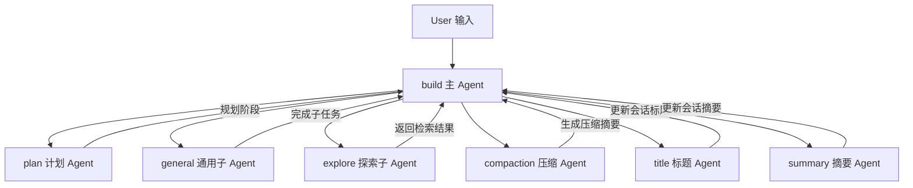

# OpenCode 内置 Agent 总览：build / plan / general / explore / compaction / title / summary

这份文档专门解释 OpenCode 里几种内置 Agent 的**区别、联系、适用场景**，并说明它们在任务链路中的分工。

对应源码主要在：

- `packages/opencode/src/agent/agent.ts`
- `packages/opencode/src/session/prompt.ts`
- `packages/opencode/src/session/processor.ts`
- `packages/opencode/src/session/compaction.ts`
- `packages/opencode/src/session/summary.ts`

---

## 1. 先给结论

OpenCode 的 Agent 不是“同一种角色的不同名字”，而是**同一个 Agent 框架下的不同职责配置**。

可以粗略分成三类：

1. **主执行 Agent**
   - `build`
   - `plan`

2. **子任务 Agent**
   - `general`
   - `explore`

3. **系统维护 Agent**
   - `compaction`
   - `title`
   - `summary`

这三类 Agent 在系统里的作用完全不同：

- 主执行 Agent 负责用户可见的主要任务流
- 子任务 Agent 负责被调用去做局部工作
- 系统维护 Agent 负责标题、摘要、压缩等后台能力

---

## 2. 核心定义：Agent 在源码里长什么样

`packages/opencode/src/agent/agent.ts` 中，`Agent.Info` 主要包含：

- `name`
- `description`
- `mode`：`subagent` / `primary` / `all`
- `permission`
- `model`
- `prompt`
- `steps`
- `hidden`
- `temperature`
- `topP`
- `options`

### 2.1 三个最关键的判定维度

#### `mode`
- `primary`：可以作为主会话入口
- `subagent`：只能作为子任务执行器
- `all`：两者都可以，通常用于用户自定义 agent

#### `hidden`
- `true`：不在通常的选择列表里展示
- 常用于内部系统 agent，如 `compaction`、`title`、`summary`

#### `permission`
- 决定这个 agent 能调用哪些工具
- 是区分 agent 行为边界的最关键因素之一

---

## 3. 一张图看懂关系

---

## 4. `build`：默认主 Agent

### 4.1 定位

`build` 是系统默认的主 Agent。

源码特征：

- `mode: "primary"`
- `native: true`
- 描述里明确写着：**The default agent. Executes tools based on configured permissions.**

### 4.2 职责

`build` 负责真正执行用户任务：

- 处理常规开发请求
- 调用工具
- 修改代码
- 推进主会话状态

### 4.3 权限边界

它使用默认权限，并额外放宽了：

- `question: allow`
- `plan_enter: allow`

这说明它不仅能执行，还能：

- 进入计划阶段
- 和用户继续交互

### 4.4 适合场景

- 直接实现功能
- 修复 bug
- 编写测试
- 修改多个文件

### 4.5 和其他 agent 的关系

- 它是主节点
- 可以调用 `plan` 做前期设计
- 可以调用 `general` / `explore` 做子任务
- 会在整体流程里协调系统维护型 agent 的结果

---

## 5. `plan`：计划 Agent

### 5.1 定位

`plan` 也是 `primary`，但它的角色不是执行，而是**先规划再执行**。

源码特征：

- `mode: "primary"`
- `native: true`
- 描述里写着：**Plan mode. Disallows all edit tools.**

### 5.2 职责

它的工作重点是：

- 梳理需求
- 拆分步骤
- 设计架构
- 生成计划文件

### 5.3 权限边界

`plan` 的关键限制是：

- 大部分 `edit` 工具被 deny
- 只允许在计划文件相关区域进行有限写入
- 对 `plan_exit` 放行，支持从计划阶段回到执行阶段

### 5.4 适合场景

- 大改动前的方案设计
- 多模块任务拆解
- 需要明确步骤和风险控制时

### 5.5 和 `build` 的关系

两者都是主 Agent，但分工不同：

- `plan`：负责“想清楚”
- `build`：负责“做出来”

通常建议流程是：

1. 先 `plan`
2. 再 `build`

---

## 6. `general`：通用子 Agent

### 6.1 定位

`general` 是一个通用型 `subagent`。

源码特征：

- `mode: "subagent"`
- `native: true`
- 描述强调：适合复杂问题、多个工作单元、并行执行
- 明确禁用 `todowrite`

### 6.2 职责

`general` 适合：

- 承接被拆出来的局部子任务
- 做复杂但相对独立的执行工作
- 并行处理多个工作块

### 6.3 权限边界

`general` 的约束比 `build` 更强：

- 不能污染主会话的 todo 列表
- 作为子节点执行，而不是主控节点

### 6.4 适合场景

- 一个大任务拆出多个独立子任务
- 某一部分需要独立研究和执行
- 适合并行推进的局部工作

### 6.5 和 `build` 的关系

- `build` 是总控
- `general` 是执行某个子块的工人
- `general` 更适合被 `task` 工具调用

---

## 7. `explore`：探索型子 Agent

### 7.1 定位

`explore` 也是 `subagent`，但它不是通用执行器，而是**检索/搜索专家**。

源码特征：

- `mode: "subagent"`
- `native: true`
- `prompt: PROMPT_EXPLORE`
- 工具权限主要集中在只读和搜索类能力

### 7.2 权限边界

`explore` 基本只允许：

- `grep`
- `glob`
- `list`
- `read`
- `bash`
- `webfetch`
- `websearch`
- `codesearch`

它的设计目标不是修改系统，而是快速找到答案。

### 7.3 适合场景

- 找函数定义
- 搜索某个事件处理路径
- 了解某个概念在哪些文件里出现
- 快速回答“这段逻辑在哪里”

### 7.4 和 `general` 的区别

- `explore`：偏“查”
- `general`：偏“做”

两者都是子 Agent，但职责完全不同。

---

## 8. `compaction`：压缩 Agent

### 8.1 定位

`compaction` 是内部系统 Agent，用来做上下文压缩。

源码特征：

- `mode: "primary"`
- `hidden: true`
- `prompt: PROMPT_COMPACTION`
- `permission: { "*": "deny" }` 为主

### 8.2 职责

它不做正常开发任务，而是：

- 汇总当前对话
- 生成继续工作的摘要
- 把长上下文压缩成短摘要

### 8.3 为什么要隐藏

因为它不是用户显式选的业务 Agent，而是系统内部维护能力。

### 8.4 和 memory 的关系

`compaction` 的结果通常会被写成：

- `summary: true` 的 assistant message

所以它本质上是 memory 压缩链路的一部分。

### 8.5 适合场景

用户不直接“使用”它；系统在这些情况下会自动调用：

- 上下文过长
- 需要总结当前进展
- 需要为下一轮对话保留关键信息

---

## 9. `title`：标题 Agent

### 9.1 定位

`title` 也是内部系统 Agent，用来自动生成会话标题。

源码特征：

- `mode: "primary"`
- `hidden: true`
- `temperature: 0.5`
- `prompt: PROMPT_TITLE`
- `permission: { "*": "deny" }`

### 9.2 职责

它只做一件事：

- 生成简洁、合适的会话标题

### 9.3 为什么独立出来

因为标题生成通常是轻量、短文本、低风险的后台任务，和主对话逻辑分开更清晰。

### 9.4 和其他 agent 的关系

- 由系统后台触发
- 不参与主业务执行
- 不改变用户任务本身

---

## 10. `summary`：摘要 Agent

### 10.1 定位

`summary` 是内部系统 Agent，用来生成会话总结。

源码特征：

- `mode: "primary"`
- `hidden: true`
- `prompt: PROMPT_SUMMARY`
- `permission: { "*": "deny" }`

### 10.2 职责

它用于：

- 生成对当前会话的总结
- 抽取任务完成情况
- 形成适合后续阅读的摘要文本

### 10.3 和 `compaction` 的区别

- `compaction`：偏“压缩上下文，保留继续工作所需的关键信息”
- `summary`：偏“总结会话结果，偏阅读和归档”

两者都与 memory 有关，但用途不同。

### 10.4 适合场景

- 会话结束后归档
- 自动生成总结
- 给用户一个可读的任务结论

---

## 11. 它们之间的联系：一个完整层级

可以把它们理解成这样：

### 11.1 主会话层
- `build`
- `plan`

负责总体流程和最终结果。

### 11.2 子任务层
- `general`
- `explore`

负责把部分工作拆出去做。

### 11.3 系统维护层
- `compaction`
- `title`
- `summary`

负责背景维护，不直接承接用户主要任务。

---

## 12. 和 `mode` 的关系

### `primary`
表示可以作为主入口。

典型有：
- `build`
- `plan`
- `compaction`
- `title`
- `summary`

### `subagent`
表示只能作为子任务执行器。

典型有：
- `general`
- `explore`

### `all`
表示主入口和子任务入口都可用。

这通常用于用户自定义 agent。

---

## 13. 和 `hidden` 的关系

`hidden` 主要用来区分：

- 用户可见的业务 agent
- 系统内部使用的 agent

### 通常可见的
- `build`
- `plan`
- `general`
- `explore`

### 通常隐藏的
- `compaction`
- `title`
- `summary`

---

## 14. 选型建议

### 14.1 如果你要直接做事
选 `build`

### 14.2 如果你要先想清楚方案
选 `plan`

### 14.3 如果你要把一个复杂任务拆成多个子任务
选 `general`

### 14.4 如果你要快速找代码、读仓库、做检索
选 `explore`

### 14.5 如果是系统自动后台动作
通常是：
- `compaction`
- `title`
- `summary`

系统自己触发，不需要手动选。

---

## 15. 一句话总结

- `build` 是默认主执行 Agent
- `plan` 是规划 Agent
- `general` 是通用执行型子 Agent
- `explore` 是检索型子 Agent
- `compaction` 是压缩记忆的内部 Agent
- `title` 是生成标题的内部 Agent
- `summary` 是生成摘要的内部 Agent

它们共同构成了 OpenCode 的 Agent 分层体系：

**主执行 → 计划 → 子任务 → 检索 → 后台维护**

