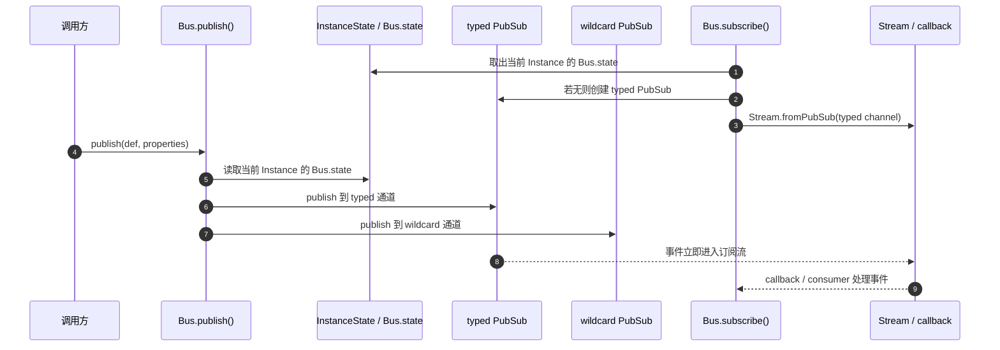
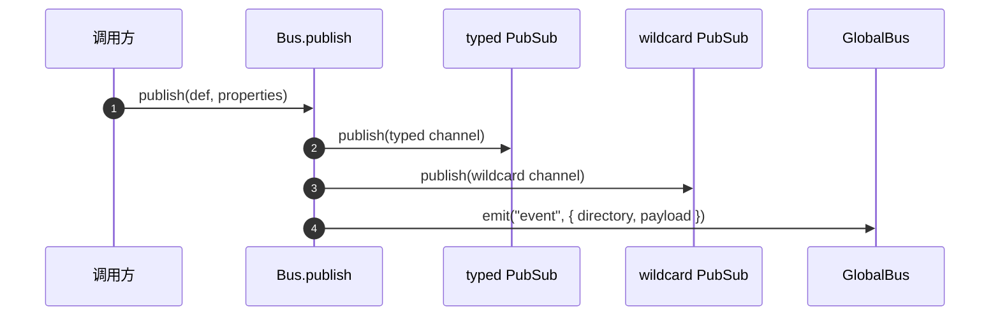

# Bus 事件总线

`Bus` 是 OpenCode 的**进程内事件总线**，用于在同一个 `Instance` 内做事件发布、订阅和生命周期通知。

它解决的问题很明确：

- 让模块之间不要直接相互依赖
- 让系统内部事件可以按类型订阅
- 让所有事件都能被一个全局订阅者看到
- 让不同 `Instance` 的事件严格隔离
- 让 `Instance` 销毁时能够发出最后一条通知

对应源码主要在：

- `packages/opencode/src/bus/index.ts`
- `packages/opencode/src/bus/bus-event.ts`
- `packages/opencode/src/bus/global.ts`
- 测试：`packages/opencode/test/bus/bus.test.ts`

---

## 1. Bus 是什么，不是什么

### 1.1 Bus 是什么

`Bus` 是一个**类型安全的事件分发中心**。

它支持：

- 按事件类型发布
- 按事件类型订阅
- 订阅全部事件
- 订阅回调式 API
- 自动处理 `Instance` 作用域
- 在 `Instance` 销毁时通知订阅者

### 1.2 Bus 不是什么

`Bus` 不是：

- 数据库
- 持久化队列
- 跨进程消息中间件
- 网络总线

它只负责**当前进程、当前 `Instance` 内的事件流转**。

---

## 2. 核心设计

`Bus` 由三层组成：

1. **`BusEvent`**：定义事件类型与 payload schema
2. **`Bus`**：负责发布、订阅、生命周期管理
3. **`GlobalBus`**：负责把内部事件桥接到更上层的全局监听体系

```mermaid
flowchart TB
  D[BusEvent.define()] --> B[Bus.publish / subscribe]
  B --> S1[typed PubSub]
  B --> S2[wildcard PubSub]
  B --> G[GlobalBus.emit]
  G --> U[更上层监听者 / UI / Server]
```

### 2.1 底层原理

`Bus` 的消息传递不是共享内存，也不是跨进程通信，而是基于 `effect` 的 **PubSub** 事件流：

- `InstanceState` 为每个 `Instance` 持有独立的 Bus 状态
- `typed PubSub` 保存某个事件类型的订阅通道
- `wildcard PubSub` 保存所有事件的通道
- `Stream.fromPubSub()` 把订阅通道转换成可消费的流
- `Scope` 管理订阅生命周期，确保取消订阅时能正确关闭资源

因此，`publish()` 的本质是：**把一个已验证结构的事件对象，直接投递到当前 `Instance` 的内存内事件通道里**。

### 2.2 为什么订阅者能立即收到

因为订阅链路在同一个进程里同步建立：

1. `Bus.subscribe()` 先在当前 `Instance` 中找到或创建对应的 `PubSub`
2. `Stream.fromPubSub()` 立刻把这个通道挂到订阅者
3. `Bus.publish()` 直接向同一个 `PubSub` 投递事件
4. 所以只要订阅已经存在，后续发布就能马上被消费

### 2.3 publish -> subscribe 的底层执行流程图



---

## 3. `BusEvent`：事件类型定义器

源码：`packages/opencode/src/bus/bus-event.ts`

`BusEvent.define(type, schema)` 会创建一个事件定义：

- `type`：事件名，如 `session.updated`
- `properties`：Zod schema，定义事件 payload 结构

### 3.1 它的作用

它有两个作用：

1. **类型约束**：保证发布和订阅时的数据结构一致
2. **注册表**：`payloads()` 可以把所有已定义事件拼成 discriminated union

### 3.2 为什么要先定义再发布

因为 `Bus.publish()` 需要知道：

- 事件类型是什么
- payload 应该长什么样

这能避免“随便发一个对象”导致的结构不一致。

---

## 4. `Bus` 的公开 API

源码：`packages/opencode/src/bus/index.ts`

### 4.1 `Bus.publish(def, properties)`

发布一个事件。

#### 行为

- 构造 `{ type, properties }`
- 投递到对应类型的订阅者
- 同时投递到 wildcard 订阅者
- 再通过 `GlobalBus.emit("event", ...)` 向外桥接

#### 特点

- 不要求必须有订阅者
- 没有订阅者时也不会报错
- 类型通过 `BusEvent` 保证

---

### 4.2 `Bus.subscribe(def, callback)`

订阅指定类型事件。

#### 行为

- 只接收 `def.type` 对应的事件
- 返回一个取消订阅函数 `unsub()`
- 底层通过 `PubSub` + `Scope` 管理生命周期

#### 特点

- 订阅后立刻生效
- 每个订阅者彼此隔离
- 取消后不会再收到后续事件

---

### 4.3 `Bus.subscribeAll(callback)`

订阅所有事件。

#### 行为

- 接收所有 event type
- 包括系统内部事件
- 常用于调试、日志、桥接、全局同步

#### 特点

- 它订阅的是 `wildcard` PubSub
- 不做类型过滤

---

## 5. Bus 的内部结构

`Bus` 的内部 state 大致是：

- `wildcard`：一个全局 PubSub，接收所有事件
- `typed`：`Map<string, PubSub>`，每种事件类型一个独立通道

### 5.1 为什么要分 typed 和 wildcard

这样可以同时满足两类需求：

- **按类型精确订阅**：性能更高，语义更清晰
- **全局监听**：调试和桥接更方便

---

## 6. 发布流程



### 6.1 关键点

1. 如果存在对应类型的 `typed` 通道，就投递给它
2. 同时投递给 `wildcard`
3. 最后发到 `GlobalBus`

### 6.2 这意味着什么

同一个事件会有三种“可见性”：

- 只关心这个类型的订阅者可以收到
- 关心全部事件的订阅者可以收到
- 更上层系统也可以通过 `GlobalBus` 看到

---

## 7. 订阅流程

### 7.1 `subscribe()` 的底层做法

`subscribe(def)` 会：

1. 在 `typed` map 中查找该事件类型的 PubSub
2. 如果没有，就创建一个新的 PubSub
3. 返回 `Stream.fromPubSub(ps)`
4. 在流结束时打印 `unsubscribing`

### 7.2 `subscribeAll()` 的底层做法

`subscribeAll()` 直接订阅 `wildcard` PubSub。

### 7.3 回调式订阅

`subscribeCallback()` / `subscribeAllCallback()` 会把 stream 包装成：

- 取到事件后立即执行 callback
- callback 报错时只记录日志，不会把整个总线打崩
- 返回 `unsub()`，用来关闭作用域

---

## 8. 取消订阅是怎么工作的

`Bus.subscribe()` 和 `Bus.subscribeAll()` 的回调 API 都返回取消函数。

### 8.1 取消动作

调用 `unsub()` 后会：

- 关闭对应的 `Scope`
- 停止后续事件分发
- 让这个订阅者从总线上退出

### 8.2 这类设计的好处

- 不需要手动管理复杂的监听器列表
- 不容易泄漏订阅
- 很适合临时监听、测试、调试场景

---

## 9. `Instance` 隔离

`Bus` 不是全局单例式“共享所有项目”的总线，而是按 `Instance` 隔离。

### 9.1 什么是 Instance 隔离

每个 `Instance` 都有自己的：

- `Bus.state`
- `wildcard` PubSub
- `typed` PubSub map

所以：

- A 项目的事件不会跑到 B 项目
- 订阅者只会收到自己 `Instance` 里的事件

### 9.2 为什么要这样做

因为 OpenCode 可以同时运行多个项目目录。

如果不隔离：

- 事件会串台
- UI 会混乱
- 调试会非常难

---

## 10. `Instance.disposeAll()` 时会发生什么

这是 `Bus` 最重要的生命周期点之一。

### 10.1 销毁顺序

在 `Bus` 的 finalizer 中，会：

1. 先发布一条 `server.instance.disposed`
2. 再 shutdown `wildcard`
3. 再 shutdown 所有 `typed` PubSub

### 10.2 为什么先发销毁事件

源码里明确写了：

> Publish InstanceDisposed before shutting down so subscribers see it

也就是说，销毁通知必须在流结束前送达，否则订阅者就来不及处理了。

### 10.3 这条事件的用途

- 清理 UI 状态
- 清理缓存
- 提前通知上层“这个 instance 结束了”

---

## 11. `GlobalBus` 的角色

源码：`packages/opencode/src/bus/global.ts`

`GlobalBus` 是一个更上层的 `EventEmitter`，用于把内部事件桥接出去。

### 11.1 它和 `Bus` 的关系

- `Bus`：当前 `Instance` 的内部事件分发
- `GlobalBus`：更高层的统一事件出口

### 11.2 为什么要桥接到 `GlobalBus`

因为很多模块都希望“只关心全局事件”，比如：

- server routes
- project/workspace 状态
- UI 同步层

`Bus.publish()` 里把事件 emit 到 `GlobalBus`，就是为了这条桥。

---

## 12. 典型使用方式

### 12.1 定义事件

```ts
const Ping = BusEvent.define("test.ping", z.object({ value: z.number() }))
```

### 12.2 订阅事件

```ts
const unsub = Bus.subscribe(Ping, (evt) => {
  console.log(evt.properties.value)
})
```

### 12.3 发布事件

```ts
await Bus.publish(Ping, { value: 42 })
```

### 12.4 监听全部事件

```ts
Bus.subscribeAll((evt) => {
  console.log(evt.type)
})
```

---

## 13. Bus 的测试覆盖了什么

测试文件：`packages/opencode/test/bus/bus.test.ts`

### 覆盖点

- 订阅者立即生效
- 匹配事件接收
- 不匹配事件不会收到
- 没有订阅者时发布不报错
- 取消订阅后停止接收
- `subscribeAll()` 接收所有事件
- 多订阅者同时接收
- 不同 `Instance` 之间隔离
- `Instance.disposeAll()` 时能收到 `InstanceDisposed`

### 测试说明

这份测试基本把 `Bus` 的行为边界都验证了一遍，所以它是理解 `Bus` 的最佳辅助材料。

---

## 14. 它和其他模块的关系

`Bus` 经常被这些模块使用：

- `Session`
- `ACP`
- `Project`
- `Workspace`
- `Config`
- `Instance`

### 常见模式

- 某个模块完成状态变化后发布事件
- 其他模块订阅后更新 UI 或状态
- 全局事件桥接层再把它同步出去

---

## 15. 新手可以怎么理解它

你可以把 `Bus` 想成一个**项目内广播站**：

- `BusEvent.define()` = 先登记广播频道和消息格式
- `Bus.publish()` = 广播消息
- `Bus.subscribe()` = 只听某个频道
- `Bus.subscribeAll()` = 听所有频道
- `Instance.disposeAll()` = 广播站关机前的最后通知

---

## 16. 一句话总结

`Bus` 是 OpenCode 的**实例内类型安全事件总线**：它用 `BusEvent` 定义消息格式，用 `PubSub` 完成分发，用 `Instance` 保证隔离，用 `GlobalBus` 把事件再桥接到更上层系统。

