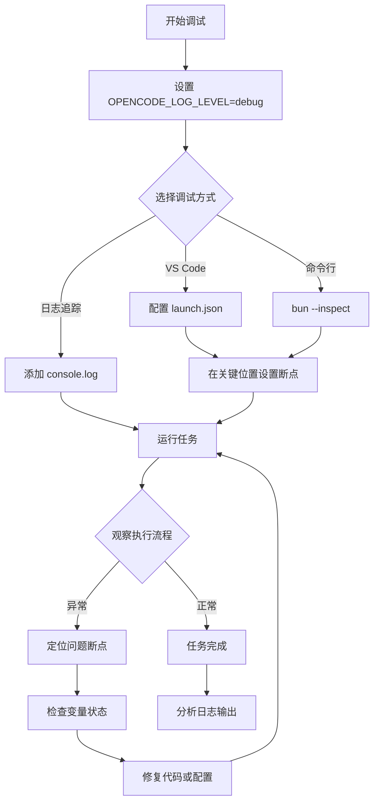
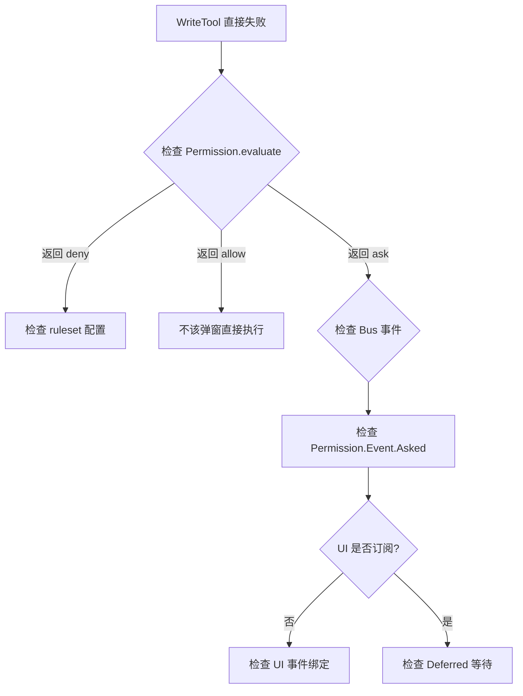
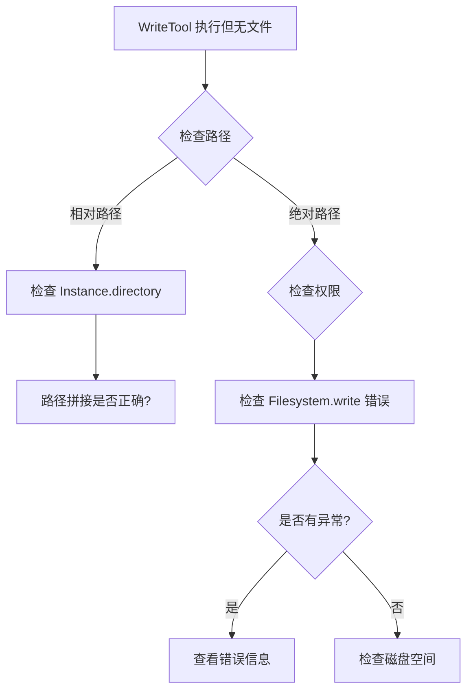

# 调试工作流：生成python冒泡排序代码并验证结果

本文展示如何逐步调试 "生成python冒泡排序代码，并验证结果正确性" 任务的完整过程。

---

## 调试准备流程



---

## 逐步调试示例

### 第 1 步：启动并观察入口

**操作：**
```bash
cd packages/opencode
OPENCODE_LOG_LEVEL=debug bun run --conditions=browser ./src/index.ts run -- "生成python冒泡排序代码，并验证结果正确性"
```

**预期看到的日志：**
```
[session] created { id: '01HQ...', title: 'New session - 2026-03-30T...' }
[session.prompt] loop { step: 0, sessionID: '01HQ...' }
[agent] state initialized
[skill] init { count: 3 }
```

**检查点：**
- [ ] 会话是否成功创建？
- [ ] 是否有 Skill 被加载？
- [ ] loop 是否正常启动？

---

### 第 2 步：跟踪 Agent 选择

**添加断点：** `packages/opencode/src/session/prompt.ts:596`

```typescript
const agent = await Agent.get(lastUser.agent)
// ← 在这里添加断点
```

**检查变量：**
```javascript
// 在调试控制台输入
lastUser.agent      // "build"
agent.name          // "build"
agent.mode          // "primary"
agent.permission    // Array of rules
agent.model         // undefined (使用用户默认模型)
```

**如果 Agent 不存在：**
- 检查 `lastUser.agent` 的值
- 检查 `Agent.list()` 返回的可用 Agents

---

### 第 3 步：验证 Skill 加载

**添加断点：** `packages/opencode/src/skill/index.ts:230`

```typescript
const available = Effect.fn("Skill.available")(function* (agent?: Agent.Info) {
  const s = yield* InstanceState.get(state)
  // ← 在这里添加断点
  const list = Object.values(s.skills)
```

**检查变量：**
```javascript
Object.keys(s.skills)   // ["python-best-practices", "algorithm-templates", ...]
s.dirs                  // Set of skill directories
```

**添加断点：** `packages/opencode/src/session/system.ts` (查找 skills 注入点)

检查 system prompt 是否包含 Skill 列表。

---

### 第 4 步：检查工具解析

**添加断点：** `packages/opencode/src/session/prompt.ts:772`

```typescript
export async function resolveTools(input: {...}) {
  // ← 在这里添加断点
  using _ = log.time("resolveTools")
```

**检查变量：**
```javascript
input.agent.name           // "build"
input.model.id             // "gpt-4"
input.model.providerID     // "openai"
input.session.permission   // undefined or Ruleset
```

**单步跟踪：**
1. 进入 `ToolRegistry.tools()` 调用
2. 观察返回的工具列表
3. 检查每个工具的 `description` 和 `parameters`

---

### 第 5 步：监控 LLM 调用

**添加断点：** `packages/opencode/src/session/llm.ts:68`

```typescript
export async function stream(input: StreamInput) {
  // ← 在这里添加断点
  l.info("stream", { ... })
```

**检查变量：**
```javascript
input.system.length        // System prompt 段落数
input.system[0]            // 基础指令
input.system[1]            // Skills (如果有)
input.messages.length      // 历史消息数
Object.keys(input.tools)   // ["bash", "read", "edit", "write", "skill", ...]
```

**关键检查：**
- `input.tools.write` 是否存在？
- `input.tools.skill` 是否存在？
- `input.system` 是否包含 Skill 内容？

---

### 第 6 步：跟踪流事件

**添加断点：** `packages/opencode/src/session/processor.ts:115`

```typescript
const handleEvent = Effect.fn("SessionProcessor.handleEvent")(function* (value: StreamEvent) {
  // ← 在这里添加条件断点: value.type === "tool-call"
  switch (value.type) {
```

**事件序列预期：**
```
type: "start-step"
type: "text-start"
type: "text-delta" × 多次
  "我来" → "帮你" → "写一个" → "冒泡" → "排序"...
type: "text-end"
type: "tool-input-start" (write)
type: "tool-call" (write)
  // 进入 WriteTool.execute()
type: "tool-result" (write)
type: "finish-step"
```

**检查 tool-call 事件：**
```javascript
value.toolCallId    // "call_01..."
value.toolName      // "write"
value.input         // { filePath: "...", content: "..." }
```

---

### 第 7 步：跟踪 WriteTool 执行

**添加断点：** `packages/opencode/src/tool/write.ts` (execute 函数入口)

```typescript
async execute(params, ctx) {
  // ← 在这里添加断点
```

**检查参数：**
```javascript
params.filePath     // "bubble_sort.py" 或完整路径
params.content      // "def bubble_sort(arr):\n    ..."
ctx.sessionID       // "01HQ..."
ctx.messageID       // "msg_..."
ctx.agent           // "build"
```

**跟踪权限检查：**
```typescript
await ctx.ask({
  permission: "edit",
  patterns: [filepath],
  // ← 在 packages/opencode/src/permission/index.ts:166 添加断点
})
```

**权限评估检查：**
```javascript
// 在 Permission.ask 内部
ruleset              // 合并后的权限规则
request.permission   // "edit"
request.patterns     // ["/path/to/bubble_sort.py"]
rule.action          // "ask" | "allow" | "deny"
```

---

### 第 8 步：验证文件写入

**在 WriteTool 执行后检查：**

```bash
# 在另一个终端
ls -la /path/to/workdir/bubble_sort.py
cat /path/to/workdir/bubble_sort.py
```

**预期输出：**
```python
def bubble_sort(arr):
    n = len(arr)
    for i in range(n):
        for j in range(0, n - i - 1):
            if arr[j] > arr[j + 1]:
                arr[j], arr[j + 1] = arr[j + 1], arr[j]
    return arr
```

---

### 第 9 步：检查循环继续

**添加断点：** `packages/opencode/src/session/prompt.ts:726`

```typescript
const modelFinished = processor.message.finish && !["tool-calls", "unknown"].includes(processor.message.finish)
// ← 在这里添加断点
```

**第一轮迭代后：**
```javascript
processor.message.finish     // "tool-calls"
modelFinished                // false
result                       // "continue"
```

**第二轮迭代后：**
```javascript
processor.message.finish     // "stop"
modelFinished                // true
result                       // "continue"
```

---

### 第 10 步：验证会话摘要

**添加断点：** `packages/opencode/src/session/summary.ts:71`

```typescript
export const summarize = fn(
  z.object({ sessionID: SessionID.zod, messageID: MessageID.zod }),
  async (input) => {
    // ← 在这里添加断点
```

**检查计算结果：**
```javascript
diffs              // [{ file: ".../bubble_sort.py", additions: 10, deletions: 0 }]
additions          // 10 (总行数)
files              // 1
```

---

## 常见问题调试路径

### 场景 1：模型不生成代码

```mermaid
flowchart TD
    A[模型只回复文字] --> B{检查 Tools}
    B -->|write 不存在| C[resolveTools 问题]
    B -->|write 存在| D{检查 Prompt}
    
    C --> E[检查 Agent.permission]
    E --> F{edit 被 deny?}
    F -->|是| G[修改权限配置]
    F -->|否| H[检查 ToolRegistry]
    
    D --> I[检查 system prompt]
    I --> J{是否明确告知可以写文件?}
    J -->|否| K[优化 prompt]
    J -->|是| L[检查 model 温度设置]
```



### 场景 2：权限对话框不弹出



### 场景 3：文件没有创建



---

## 高级调试技巧

### 1. 使用 Effect 的追踪功能

```typescript
// 在代码中添加追踪
import { Effect } from "effect"

const program = Effect.gen(function* () {
  yield* Effect.log("Entering function")
  const result = yield* someOperation
  yield* Effect.log("Operation result").pipe(
    Effect.annotateLogs({ result })
  )
  return result
}).pipe(
  Effect.withSpan("my-operation"),  // OpenTelemetry 追踪
  Effect.tapBoth({
    onFailure: (e) => Effect.logError("Failed", e),
    onSuccess: (a) => Effect.log("Success", a)
  })
)
```

### 2. 捕获完整的 LLM 请求/响应

```typescript
// packages/opencode/src/session/llm.ts
export async function stream(input: StreamInput) {
  // 保存完整请求
  console.log("[LLM REQUEST]", JSON.stringify({
    system: input.system,
    messages: input.messages,
    tools: Object.keys(input.tools)
  }, null, 2))
  
  const result = streamText({ ... })
  
  // 捕获完整响应
  const events: any[] = []
  for await (const event of result.fullStream) {
    events.push(event)
    // ... 原有处理
  }
  
  console.log("[LLM RESPONSE]", JSON.stringify(events, null, 2))
}
```

### 3. 使用 SQLite 浏览器查看数据

推荐工具：DB Browser for SQLite

查看表：
- `sessions` - 会话列表
- `messages` - 消息数据 (JSON 在 `data` 列)
- `parts` - Part 数据
- `permissions` - 持久化的权限规则

### 4. 模拟特定场景

```typescript
// 测试代码片段
cd packages/opencode
bun repl

# 模拟加载 Skill
> const { Skill } = await import("./src/skill")
> const skills = await Skill.all()
> console.log(skills)

# 模拟权限评估
> const { Permission } = await import("./src/permission")
> const agent = await Agent.get("build")
> const result = Permission.evaluate("edit", "*.py", agent.permission)
> console.log(result)
```

---

## 调试清单

执行冒泡排序任务前，确认：

- [ ] 环境变量 `OPENCODE_LOG_LEVEL` 设置为 `debug`
- [ ] 工作目录可写
- [ ] 已配置 LLM API 密钥
- [ ] 目标 Agent (`build`) 存在
- [ ] `write` 工具在可用工具列表中
- [ ] Agent 的 permission 没有 deny `edit`

任务执行时检查：

- [ ] User Message 成功创建
- [ ] Agent 成功获取
- [ ] Skill 正确加载（如果有）
- [ ] System Prompt 组装正确
- [ ] LLM 流正常启动
- [ ] 收到 `text-delta` 事件
- [ ] 收到 `tool-call` 事件（write）
- [ ] WriteTool 执行成功
- [ ] 文件实际创建在磁盘上
- [ ] 第二轮 LLM 调用正常
- [ ] 任务正常结束
