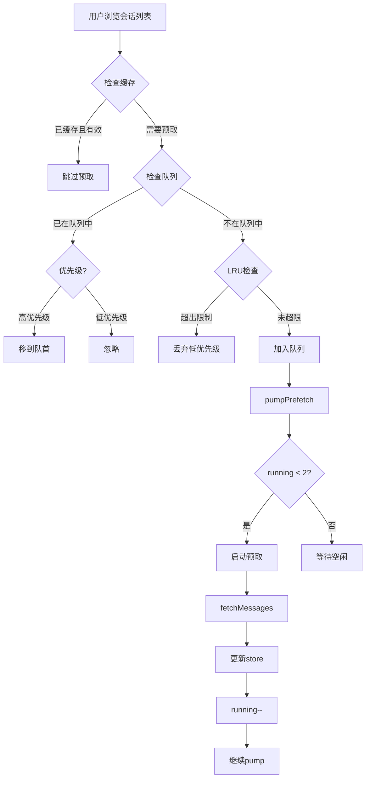

# OpenCode 调度系统完整指南

本文档详细整理了 OpenCode 工程中所有与调度相关的功能模块，包括任务调度、并发控制、重试机制、锁机制、事件批处理等核心组件。

---

## 目录

1. [概述](#概述)
2. [任务调度系统](#任务调度系统)
3. [会话预取调度](#会话预取调度)
4. [刷新队列调度](#刷新队列调度)
5. [重试策略调度](#重试策略调度)
6. [文件锁调度](#文件锁调度)
7. [内存读写锁](#内存读写锁)
8. [批处理工具](#批处理工具)
9. [事件批处理](#事件批处理)
10. [防抖与节流](#防抖与节流)
11. [异步队列与工作池](#异步队列与工作池)
12. [设计原则总结](#设计原则总结)

---

## 概述

OpenCode 的调度系统设计遵循以下核心原则：

- **简单优先**：大多数场景使用串行执行，避免不必要的复杂性
- **资源可控**：通过并发限制防止资源耗尽
- **容错性强**：内置重试、超时、崩溃恢复机制
- **优先级支持**：关键操作可以优先调度
- **分布式安全**：基于文件的锁机制支持多进程互斥

---

## 任务调度系统

### 子任务并行调度

**位置**: `packages/opencode/src/session/prompt.ts` (L516-L798)

#### 核心概念

子任务(Task Tool)是委托给其他 agent 执行的独立任务。系统支持可配置的并行池，允许同时执行多个子任务以提高吞吐量。

#### 实现细节

```typescript
// 最大并发度配置
const MAX_PARALLEL_SUBTASKS = 3

// 如果只有一个任务或并发度为1，使用串行路径
if (tasks.length === 0 || MAX_PARALLEL_SUBTASKS <= 1) {
  // 串行执行逻辑...
} else {
  // 并行批量执行分支
  const created: Array<{ task: Subtask; assistant: MessageV2.Assistant; part: MessageV2.ToolPart }> = []
  
  // 准备最多 MAX_PARALLEL_SUBTASKS 个子任务
  for (let i = 1; i < MAX_PARALLEL_SUBTASKS; i++) {
    const next = tasks.pop()
    if (!next) break
    
    // 创建助手消息和工具部分
    const assistantMessage = await Session.updateMessage({...})
    const part = await Session.updatePart({...})
    
    created.push({ task: next, assistant: assistantMessage, part })
  }
  
  // 并行执行所有准备好的子任务
  const execs = created.map(async ({ task: st, assistant, part }) => {
    const ctx: Tool.Context = {
      agent: st.agent,
      messageID: assistant.id,
      sessionID,
      abort,
      callID: part.callID,
      extra: { bypassAgentCheck: true },
      messages: msgs,
      metadata: async (input) => { /* ... */ },
      async ask(req) { /* ... */ },
    }
    
    const result = await taskTool.execute(taskArgs, ctx).catch((error) => {
      executionError = error
      return undefined
    })
    
    return { st, assistant, part, result, error }
  })
  
  // 等待所有并行任务完成
  await Promise.all(execs)
  
  // 串行写回结果（保证一致性）
  for (const { assistant, part, result, error } of results) {
    // 更新消息和part状态...
  }
}
```

#### 调度策略

| 策略 | 说明 | 适用场景 |
|------|------|----------|
| **串行 LIFO** | 后进先出，最近的任务优先 | 默认模式，保证顺序可控 |
| **并行池 + 串行写回** | 并发执行 N 个任务，然后串行合并结果 | 需要提高吞吐量的场景 |
| **FIFO** | 先进先出，按产生顺序处理 | 依赖链任务（未实现） |

#### 关键特性

1. **并发限制**: 最多 3 个子任务并行执行
2. **串行写回**: 结果合并阶段串行化，避免竞态条件
3. **错误隔离**: 单个子任务失败不影响其他任务
4. **资源清理**: 使用 `using` 语法确保资源正确释放

---

## 会话预取调度

**位置**: `packages/app/src/pages/layout.tsx` (L820-L902)

### 核心概念

在用户浏览会话列表时，智能预取相邻会话的消息数据，提升用户体验。

### 实现架构

```typescript
// 预取队列结构
type PrefetchQueue = {
  pending: string[]           // 待预取的会话ID队列
  pendingSet: Set<string>     // 快速查找集合
  inflight: Set<string>       // 正在预取的会话
  running: number             // 当前并发数
}

// 预取配置
const PREFETCH_CONCURRENCY = 2        // 最大并发预取数
const PREFETCH_PENDING_LIMIT = 10     // 队列最大长度
const PREFETCH_SPAN = 2               // 预取前后各2个会话
const SESSION_PREFETCH_TTL = 15_000   // 缓存有效期15秒
```

### 工作流程



### 优先级调度

```typescript
const prefetchSession = (session: Session, priority: "high" | "low" = "low") => {
  // ... 省略前置检查 ...
  
  // 高优先级插入队首，低优先级插入队尾
  if (priority === "high") q.pending.unshift(session.id)
  if (priority !== "high") q.pending.push(session.id)
  q.pendingSet.add(session.id)
  
  // 限制队列长度，超出则丢弃末尾
  while (q.pending.length > prefetchPendingLimit) {
    const dropped = q.pending.pop()
    if (!dropped) continue
    q.pendingSet.delete(dropped)
  }
  
  pumpPrefetch(directory)
}

// 使用示例
warm(sessions, index) {
  for (let offset = 1; offset <= span; offset++) {
    const next = sessions[index + offset]
    if (next) prefetchSession(next, offset === 1 ? "high" : "low")
    
    const prev = sessions[index - offset]
    if (prev) prefetchSession(prev, offset === 1 ? "high" : "low")
  }
}
```

### 缓存失效策略

```typescript
export function shouldSkipSessionPrefetch(input: { 
  message: boolean
  info?: Meta 
  chunk: number 
  now?: number 
}) {
  if (input.message) {
    if (!input.info) return true
    if (input.info.complete) return true
    if (input.info.limit > input.chunk) return true
  } else {
    if (!input.info) return false
  }
  
  // TTL 检查：15秒内不重复预取
  return (input.now ?? Date.now()) - input.info.at < SESSION_PREFETCH_TTL
}
```

---

## 刷新队列调度

**位置**: `packages/app/src/context/global-sync/queue.ts`

### 核心概念

用于管理全局同步状态的刷新操作，支持批量处理和根级别的全量刷新。

### 实现代码

```typescript
export function createRefreshQueue(input: QueueInput) {
  const queued = new Set<string>()  // 待刷新的目录集合
  let root = false                   // 是否需要全量刷新
  let running = false                // 是否正在运行
  let timer: ReturnType<typeof setTimeout> | undefined

  const tick = () => new Promise<void>((resolve) => setTimeout(resolve, 0))

  // 从队列中取出指定数量的项目
  const take = (count: number) => {
    if (queued.size === 0) return [] as string[]
    const items: string[] = []
    for (const item of queued) {
      queued.delete(item)
      items.push(item)
      if (items.length >= count) break
    }
    return items
  }

  // 调度执行（微任务延迟）
  const schedule = () => {
    if (timer) return
    timer = setTimeout(() => {
      timer = undefined
      void drain()
    }, 0)
  }

  // 添加单个目录到队列
  const push = (directory: string) => {
    if (!directory) return
    queued.add(directory)
    if (input.paused()) return
    schedule()
  }

  // 触发全量刷新
  const refresh = () => {
    root = true
    if (input.paused()) return
    schedule()
  }

  //  draining 循环
  async function drain() {
    if (running) return
    running = true
    try {
      while (true) {
        if (input.paused()) return
        
        // 优先处理全量刷新
        if (root) {
          root = false
          await input.bootstrap()
          await tick()
          continue
        }
        
        // 批量处理（每次2个）
        const dirs = take(2)
        if (dirs.length === 0) return
        await Promise.all(dirs.map((dir) => input.bootstrapInstance(dir)))
        await tick()
      }
    } finally {
      running = false
      // 如果还有待处理项，继续调度
      if (root || queued.size) schedule()
    }
  }

  return { push, refresh, clear, dispose }
}
```

### 调度特点

1. **去重**: 使用 Set 自动去重
2. **批量**: 每次处理 2 个项目，平衡吞吐量和响应性
3. **优先级**: 全量刷新(root)优先于增量刷新
4. **暂停支持**: 可以在暂停状态下累积请求，恢复后统一处理
5. **自驱动**: 只要有待处理项就会持续运行

---

## 重试策略调度

**位置**: `packages/opencode/src/session/retry.ts`

### 核心概念

当 LLM API 调用失败时，根据错误类型和响应头智能决定重试策略。

### 重试参数

```typescript
export namespace SessionRetry {
  export const RETRY_INITIAL_DELAY = 2000              // 初始延迟 2 秒
  export const RETRY_BACKOFF_FACTOR = 2                // 指数退避因子
  export const RETRY_MAX_DELAY_NO_HEADERS = 30_000     // 无响应头时最大延迟 30 秒
  export const RETRY_MAX_DELAY = 2_147_483_647         // 有响应头时的最大延迟（32位整数上限）
}
```

### 延迟计算算法

```typescript
export function delay(attempt: number, error?: MessageV2.APIError) {
  if (error) {
    const headers = error.data.responseHeaders
    if (headers) {
      // 1. 优先使用 retry-after-ms 头部
      const retryAfterMs = headers["retry-after-ms"]
      if (retryAfterMs) {
        const parsedMs = Number.parseFloat(retryAfterMs)
        if (!Number.isNaN(parsedMs)) {
          return cap(parsedMs)
        }
      }

      // 2. 其次使用 retry-after 头部（秒或HTTP日期）
      const retryAfter = headers["retry-after"]
      if (retryAfter) {
        const parsedSeconds = Number.parseFloat(retryAfter)
        if (!Number.isNaN(parsedSeconds)) {
          return cap(Math.ceil(parsedSeconds * 1000))
        }
        // 尝试解析为 HTTP 日期格式
        const parsed = Date.parse(retryAfter) - Date.now()
        if (!Number.isNaN(parsed) && parsed > 0) {
          return cap(Math.ceil(parsed))
        }
      }

      // 3. 降级到指数退避
      return cap(RETRY_INITIAL_DELAY * Math.pow(RETRY_BACKOFF_FACTOR, attempt - 1))
    }
  }

  // 4. 无响应头时使用受限的指数退避
  return cap(
    Math.min(
      RETRY_INITIAL_DELAY * Math.pow(RETRY_BACKOFF_FACTOR, attempt - 1), 
      RETRY_MAX_DELAY_NO_HEADERS
    )
  )
}
```

### 可重试错误识别

```typescript
export function retryable(error: Err) {
  // 上下文溢出错误不应重试
  if (MessageV2.ContextOverflowError.isInstance(error)) return undefined
  
  if (MessageV2.APIError.isInstance(error)) {
    if (!error.data.isRetryable) return undefined
    if (error.data.responseBody?.includes("FreeUsageLimitError"))
      return `Free usage exceeded, add credits https://opencode.ai/zen`
    return error.data.message.includes("Overloaded") 
      ? "Provider is overloaded" 
      : error.data.message
  }

  // 解析 JSON 错误信息
  const json = iife(() => {
    try {
      if (typeof error.data?.message === "string") {
        const parsed = JSON.parse(error.data.message)
        return parsed
      }
      return JSON.parse(error.data.message)
    } catch {
      return undefined
    }
  })
  
  if (!json || typeof json !== "object") return undefined
  
  const code = typeof json.code === "string" ? json.code : ""

  // 识别特定错误类型
  if (json.type === "error" && json.error?.type === "too_many_requests") {
    return "Too Many Requests"
  }
  if (code.includes("exhausted") || code.includes("unavailable")) {
    return "Provider is overloaded"
  }
  if (json.type === "error" && typeof json.error?.code === "string" && 
      json.error.code.includes("rate_limit")) {
    return "Rate Limited"
  }
  
  return undefined
}
```

### Effect Schedule 集成

```typescript
export function policy(opts: {
  parse: (error: unknown) => Err
  set: (input: { attempt: number; message: string; next: number }) => Effect.Effect<void>
}) {
  return Schedule.fromStepWithMetadata(
    Effect.succeed((meta: Schedule.InputMetadata<unknown>) => {
      const error = opts.parse(meta.input)
      const message = retryable(error)
      if (!message) return Cause.done(meta.attempt)
      
      return Effect.gen(function* () {
        const wait = delay(meta.attempt, MessageV2.APIError.isInstance(error) ? error : undefined)
        const now = yield* Clock.currentTimeMillis
        yield* opts.set({ attempt: meta.attempt, message, next: now + wait })
        return [meta.attempt, Duration.millis(wait)] as [number, Duration.Duration]
      })
    }),
  )
}
```

### 重试流程示例

```
第1次失败 → 等待 2s    (2000ms)
第2次失败 → 等待 4s    (2000 * 2^1)
第3次失败 → 等待 8s    (2000 * 2^2)
第4次失败 → 等待 16s   (2000 * 2^3)
第5次失败 → 等待 30s   (达到 RETRY_MAX_DELAY_NO_HEADERS 上限)
```

---

## 文件锁调度

**位置**: `packages/opencode/src/util/flock.ts`

### 核心概念

基于文件系统的分布式锁实现，支持多进程互斥访问，具备崩溃恢复能力。

### 锁结构

```
locks/
└── {hash}.lock/          # 锁目录（哈希后的key）
    ├── meta.json         # 元数据（token, pid, hostname, createdAt）
    └── heartbeat         # 心跳文件（定期更新时间戳）
```

### 获取锁流程

```typescript
async function acquireLockDir(
  lockDir: string,
  input: { key: string; onWait?: Wait; signal?: AbortSignal },
  opts: Opts,
) {
  const stop = mono() + opts.timeoutMs  // 超时时间点
  let attempt = 0
  let waited = 0
  let delay = opts.baseDelayMs  // 初始延迟 100ms

  while (true) {
    input.signal?.throwIfAborted()

    // 尝试获取锁
    const res = await tryAcquireLockDir(lockDir, opts)
    if (res.acquired) {
      return res
    }

    // 超时检查
    if (mono() > stop) {
      throw new Error(`Timed out waiting for lock: ${input.key}`)
    }

    // 指数退避 + 抖动
    attempt += 1
    const ms = jitter(delay)  // ±30% 随机抖动
    await input.onWait?.({ key: input.key, attempt, delay: ms, waited })
    await sleep(ms, input.signal)
    waited += ms
    delay = Math.min(opts.maxDelayMs, Math.floor(delay * 1.7))  // 退避因子 1.7
  }
}
```

### 过期检测与恢复

```typescript
async function stale(lockDir: string, heartbeatPath: string, metaPath: string, staleMs: number) {
  const now = wall()
  
  // 1. 检查心跳文件
  const heartbeat = await stats(heartbeatPath)
  if (heartbeat) {
    return now - heartbeat.mtimeMs > staleMs
  }

  // 2. 检查元数据文件
  const meta = await stats(metaPath)
  if (meta) {
    return now - meta.mtimeMs > staleMs
  }

  // 3. 检查锁目录本身
  const dir = await stats(lockDir)
  if (!dir) return false
  return now - dir.mtimeMs > staleMs
}
```

### Breaker 机制

防止多个进程同时尝试破锁导致的竞态条件：

```typescript
// 检测到过期锁时，先获取 breaker
const breakerPath = lockDir + ".breaker"
try {
  await mkdir(breakerPath, { mode: 0o700 })
} catch (claimErr) {
  // 如果 breaker 已存在且未过期，放弃本次尝试
  const errCode = code(claimErr)
  if (errCode === "EEXIST") {
    const breaker = await stats(breakerPath)
    if (breaker && wall() - breaker.mtimeMs > opts.staleMs) {
      await rm(breakerPath, { recursive: true, force: true }).catch(() => undefined)
    }
    return { acquired: false }
  }
  throw claimErr
}

// 持有 breaker 的进程负责清理并重新获取锁
try {
  if (!(await stale(lockDir, heartbeatPath, metaPath, opts.staleMs))) {
    return { acquired: false }
  }
  await rm(lockDir, { recursive: true, force: true })
  await mkdir(lockDir, { mode: 0o700 })
} finally {
  await rm(breakerPath, { recursive: true, force: true }).catch(() => undefined)
}
```

### 心跳机制

防止长时间持有锁被误判为过期：

```typescript
const startHeartbeat = (intervalMs = Math.max(100, Math.floor(opts.staleMs / 3))) => {
  if (timer) return
  // 每 intervalMs 更新一次心跳文件时间戳
  timer = setInterval(() => {
    const t = new Date()
    void utimes(heartbeatPath, t, t).catch(() => undefined)
  }, intervalMs)
  timer.unref?.()  // 不阻止进程退出
}
```

### Token 验证

防止误释放其他进程的锁：

```typescript
const release = async () => {
  // 读取当前元数据
  const current = await readFile(metaPath, "utf8")
    .then((raw) => {
      const parsed = JSON.parse(raw)
      return { token: parsed.token }
    })
  
  // 验证 token 匹配
  if (current.token !== token) {
    throw new Error("Refusing to release: lock token mismatch (not the owner).")
  }

  await rm(lockDir, { recursive: true, force: true })
}
```

### 使用示例

```typescript
// 方式1: withLock 自动管理
await Flock.withLock("plugin-meta:/path/to/file", async () => {
  // 临界区代码
  await updatePluginMeta()
}, {
  staleMs: 60_000,      // 60秒视为过期
  timeoutMs: 5 * 60_000, // 5分钟超时
})

// 方式2: 手动管理（支持 async using）
await using lease = await Flock.acquire("my-lock-key", {
  staleMs: 30_000,
  timeoutMs: 2 * 60_000,
})
try {
  // 临界区代码
  await doSomething()
} finally {
  await lease.release()
}
```

### 压力测试

16 个进程并发竞争同一个锁，验证互斥性：

```typescript
test("enforces mutual exclusion under process contention", async () => {
  const n = 16  // 并发进程数
  const processes = await Promise.all(
    Array.from({ length: n }, () => 
      spawnWorker({ key: "flock:stress", dir, done, active })
    )
  )
  
  // 所有进程都成功执行
  expect(processes.map(p => p.code)).toEqual(Array(n).fill(0))
  
  // 没有 stderr 错误
  expect(processes.every(p => !p.stderr.toString())).toBe(true)
  
  // 完成日志有 16 条记录
  const lines = await fs.readFile(done, "utf-8")
  expect(lines.trim().split("\n").length).toBe(n)
})
```

---

## 内存读写锁

**位置**: `packages/opencode/src/util/lock.ts`

### 核心概念

进程内的读写锁，支持多读者单写者模式，写者优先防止饥饿。

### 实现代码

```typescript
export namespace Lock {
  const locks = new Map<string, {
    readers: number              // 当前读者数量
    writer: boolean              // 是否有写者
    waitingReaders: (() => void)[]  // 等待的读者队列
    waitingWriters: (() => void)[]  // 等待的写者队列
  }>()

  function get(key: string) {
    if (!locks.has(key)) {
      locks.set(key, {
        readers: 0,
        writer: false,
        waitingReaders: [],
        waitingWriters: [],
      })
    }
    return locks.get(key)!
  }

  // 处理等待队列
  function process(key: string) {
    const lock = locks.get(key)
    if (!lock || lock.writer || lock.readers > 0) return

    // 写者优先：防止写者饥饿
    if (lock.waitingWriters.length > 0) {
      const nextWriter = lock.waitingWriters.shift()!
      nextWriter()
      return
    }

    // 唤醒所有等待的读者
    while (lock.waitingReaders.length > 0) {
      const nextReader = lock.waitingReaders.shift()!
      nextReader()
    }

    // 清理空锁
    if (lock.readers === 0 && !lock.writer && 
        lock.waitingReaders.length === 0 && 
        lock.waitingWriters.length === 0) {
      locks.delete(key)
    }
  }

  // 获取读锁
  export async function read(key: string): Promise<Disposable> {
    const lock = get(key)

    return new Promise((resolve) => {
      // 如果没有写者且没有等待的写者，立即获取
      if (!lock.writer && lock.waitingWriters.length === 0) {
        lock.readers++
        resolve({
          [Symbol.dispose]: () => {
            lock.readers--
            process(key)
          },
        })
      } else {
        // 否则加入等待队列
        lock.waitingReaders.push(() => {
          lock.readers++
          resolve({
            [Symbol.dispose]: () => {
              lock.readers--
              process(key)
            },
          })
        })
      }
    })
  }

  // 获取写锁
  export async function write(key: string): Promise<Disposable> {
    const lock = get(key)

    return new Promise((resolve) => {
      // 如果没有读者和写者，立即获取
      if (!lock.writer && lock.readers === 0) {
        lock.writer = true
        resolve({
          [Symbol.dispose]: () => {
            lock.writer = false
            process(key)
          },
        })
      } else {
        // 否则加入等待队列
        lock.waitingWriters.push(() => {
          lock.writer = true
          resolve({
            [Symbol.dispose]: () => {
              lock.writer = false
              process(key)
            },
          })
        })
      }
    })
  }
}
```

### 使用场景

主要用于文件时间戳追踪的并发控制：

```typescript
// packages/opencode/src/file/time.ts
const getOrCreateLock = (filepath: string) => {
  return iife(async () => {
    let lock = locks.get(filepath)
    if (lock) return lock
    
    // 创建容量为 1 的信号量，实现互斥锁
    const next = Semaphore.makeUnsafe(1)
    locks.set(filepath, next)
    return next
  })
}

// 使用锁保护文件操作
await FileTime.withLock(filepath, async () => {
  // 安全的文件读写操作
  await readFile(filepath)
  await writeFile(filepath, content)
})
```

### 特性对比

| 特性 | Lock (内存) | Flock (文件) |
|------|-------------|--------------|
| **作用域** | 单进程 | 多进程/分布式 |
| **性能** | 极快（微秒级） | 较慢（毫秒级，涉及IO） |
| **持久性** | 进程重启丢失 | 文件系统持久 |
| **崩溃恢复** | 不支持 | 支持（心跳+过期检测） |
| **适用场景** | 高频并发控制 | 跨进程互斥 |

---

## 批处理工具

**位置**: `packages/opencode/src/tool/batch.ts`

### 核心概念

允许 LLM 在一次响应中并行执行多个工具调用，提高执行效率。

### 参数定义

```typescript
parameters: z.object({
  tool_calls: z
    .array(
      z.object({
        tool: z.string().describe("要执行的工具名称"),
        parameters: z.object({}).loose().describe("工具参数"),
      }),
    )
    .min(1, "至少提供一个工具调用")
    .describe("并行执行的工具调用数组"),
}),
```

### 执行流程

```typescript
async execute(params, ctx) {
  // 1. 限制最大数量为 25
  const toolCalls = params.tool_calls.slice(0, 25)
  const discardedCalls = params.tool_calls.slice(25)

  // 2. 获取可用工具映射
  const availableTools = await ToolRegistry.tools({...})
  const toolMap = new Map(availableTools.map((t) => [t.id, t]))

  // 3. 并行执行所有工具调用
  const executeCall = async (call) => {
    const partID = PartID.ascending()
    
    try {
      // 安全检查：禁止 batch 嵌套
      if (DISALLOWED.has(call.tool)) {
        throw new Error(`Tool '${call.tool}' is not allowed in batch`)
      }

      // 验证工具存在
      const tool = toolMap.get(call.tool)
      if (!tool) {
        throw new Error(`Tool '${call.tool}' not in registry`)
      }
      
      // 参数验证
      const validatedParams = tool.parameters.parse(call.parameters)

      // 更新状态为运行中
      await Session.updatePart({
        id: partID,
        state: { status: "running", input: call.parameters, time: { start: Date.now() } },
      })

      // 执行工具
      const result = await tool.execute(validatedParams, { ...ctx, callID: partID })

      // 更新状态为完成
      await Session.updatePart({
        id: partID,
        state: { 
          status: "completed", 
          output: result.output,
          attachments: result.attachments,
          time: { start: ..., end: Date.now() },
        },
      })

      return { success: true, tool: call.tool, result }
    } catch (error) {
      // 更新状态为错误
      await Session.updatePart({
        id: partID,
        state: { 
          status: "error", 
          error: errorMessage(error),
          time: { start: ..., end: Date.now() },
        },
      })
      return { success: false, tool: call.tool, error }
    }
  }

  // 4. 并行执行（Promise.all）
  const results = await Promise.all(toolCalls.map((call) => executeCall(call)))

  // 5. 处理超出的调用
  for (const call of discardedCalls) {
    await Session.updatePart({
      state: { 
        status: "error", 
        error: "Maximum of 25 tools allowed in batch",
      },
    })
  }

  // 6. 返回汇总结果
  const successfulCalls = results.filter((r) => r.success).length
  const failedCalls = results.length - successfulCalls

  return {
    title: `Batch execution (${successfulCalls}/${results.length} successful)`,
    output: failedCalls > 0
      ? `Executed ${successfulCalls}/${results.length} tools successfully. ${failedCalls} failed.`
      : `All ${successfulCalls} tools executed successfully.`,
    metadata: {
      totalCalls: results.length,
      successful: successfulCalls,
      failed: failedCalls,
      details: results.map((r) => ({ tool: r.tool, success: r.success })),
    },
  }
}
```

### 限制与约束

1. **最大数量**: 最多 25 个工具调用
2. **禁止嵌套**: `batch` 工具不能在 batch 中调用
3. **仅限注册工具**: MCP 和环境工具不能批处理
4. **完全并行**: 所有工具同时执行，无先后顺序保证

### 性能优势

```
传统方式:
  LLM → read(file1) → 等待 → read(file2) → 等待 → read(file3)
  总耗时: 3 × RTT

Batch 方式:
  LLM → batch([read(file1), read(file2), read(file3)])
  总耗时: 1 × RTT
```

---

## 事件批处理

### SSE 事件批处理

**位置**: `packages/app/src/context/global-sdk.tsx` (L46-L124)

#### 核心概念

将高频的 SSE 事件批量处理，减少 UI 渲染次数，提升性能。

#### 实现代码

```typescript
const FLUSH_FRAME_MS = 16  // 约 60fps
const STREAM_YIELD_MS = 8

let queue: Queued[] = []
let buffer: Queued[] = []
const coalesced = new Map<string, number>()  // 事件合并
let timer: ReturnType<typeof setTimeout> | undefined
let last = 0

const flush = () => {
  if (timer) clearTimeout(timer)
  timer = undefined

  if (queue.length === 0) return

  // 交换队列，避免阻塞
  const events = queue
  queue = buffer
  buffer = events
  queue.length = 0
  coalesced.clear()

  last = Date.now()
  
  // 批量更新 store（单次渲染）
  batch(() => {
    for (const event of events) {
      emitter.emit(event.directory, event.payload)
    }
  })

  buffer.length = 0
}

const schedule = () => {
  if (timer) return
  const elapsed = Date.now() - last
  // 动态调整延迟，保持稳定的帧率
  timer = setTimeout(flush, Math.max(0, FLUSH_FRAME_MS - elapsed))
}

// 事件入队
for await (const event of events.stream) {
  resetHeartbeat()
  streamErrorLogged = false
  
  const directory = event.directory ?? "global"
  const payload = event.payload
  const k = key(directory, payload)
  
  if (k) {
    const i = coalesced.get(k)
    if (i !== undefined) {
      // 合并相同 key 的事件（覆盖旧值）
      queue[i] = { directory, payload }
    } else {
      // 新事件入队
      coalesced.set(k, queue.length)
      queue.push({ directory, payload })
    }
  } else {
    queue.push({ directory, payload })
  }
  
  schedule()
}
```

#### 优化策略

1. **事件合并**: 相同 key 的事件只保留最新的一个
2. **双缓冲**: 使用两个队列交替，避免处理期间阻塞接收
3. **固定帧率**: 每 16ms 刷新一次，匹配显示器刷新率
4. **批量渲染**: SolidJS 的 `batch()` 确保多次 store 更新只触发一次渲染

### TUI 事件批处理

**位置**: `packages/opencode/src/cli/cmd/tui/context/sdk.tsx` (L41-L91)

类似 Web 端，但针对终端环境优化：

```typescript
let queue: Event[] = []
let timer: Timer | undefined
let last = 0

const flush = () => {
  if (queue.length === 0) return
  const events = queue
  queue = []
  timer = undefined
  last = Date.now()
  
  // 批量发射所有事件
  batch(() => {
    for (const event of events) {
      emitter.emit(event.type, event)
    }
  })
}

const handleEvent = (event: Event) => {
  queue.push(event)
  const elapsed = Date.now() - last

  if (timer) return
  // 如果刚刷新过（16ms内），批量处理
  if (elapsed < 16) {
    timer = setTimeout(flush, 16)
    return
  }
  // 否则立即刷新
  flush()
}
```

---

## 防抖与节流

### LSP 诊断防抖

**位置**: `packages/opencode/src/lsp/client.ts` (L216-L237)

```typescript
const DIAGNOSTICS_DEBOUNCE_MS = 150

let debounceTimer: ReturnType<typeof setTimeout> | undefined

connection.onNotification("textDocument/publishDiagnostics", (params) => {
  // 清除之前的定时器
  if (debounceTimer) clearTimeout(debounceTimer)
  
  // 设置新的防抖定时器
  debounceTimer = setTimeout(() => {
    log.info("got diagnostics", { path: normalizedPath })
    unsub?.()
    resolve()
  }, DIAGNOSTICS_DEBOUNCE_MS)
})

// 清理
finally(() => {
  if (debounceTimer) clearTimeout(debounceTimer)
  unsub?.()
})
```

**目的**: 避免 LSP 服务器频繁发送诊断信息时的过度处理。

### 滚动防抖

**位置**: `packages/app/src/context/layout-scroll.ts`

```typescript
const wait = opts.debounceMs ?? 200  // 默认 200ms

const queueScroll = (sessionKey: string) => {
  const prev = timers.get(sessionKey)
  if (prev) clearTimeout(prev)
  
  timers.set(
    sessionKey,
    setTimeout(() => flush(sessionKey), wait),
  )
}
```

**目的**: 滚动事件高频触发，防抖后只在停止滚动 200ms 后持久化位置。

### Signal 防抖

**位置**: `packages/opencode/src/cli/cmd/tui/util/signal.ts`

```typescript
import { debounce } from "@solid-primitives/scheduled"

export function useDebouncedSignal<T>(value: Accessor<T>, ms: number) {
  const [get, set] = createSignal(value())
  return [get, debounce((v: T) => set(() => v), ms)]
}
```

**用途**: TUI 界面中的信号值变化防抖。

---

## 异步队列与工作池

### AsyncQueue

**位置**: `packages/opencode/src/util/queue.ts`

#### 实现

```typescript
export class AsyncQueue<T> implements AsyncIterable<T> {
  private queue: T[] = []
  private resolvers: ((value: T) => void)[] = []

  push(item: T) {
    const resolve = this.resolvers.shift()
    if (resolve) resolve(item)  // 有等待的消费者，直接交付
    else this.queue.push(item)  // 否则入队
  }

  async next(): Promise<T> {
    if (this.queue.length > 0) return this.queue.shift()!
    // 队列为空，返回一个 Promise，等待生产者
    return new Promise((resolve) => this.resolvers.push(resolve))
  }

  async *[Symbol.asyncIterator]() {
    while (true) yield await this.next()
  }
}
```

#### 使用场景

生产者-消费者模式，解耦生产和消费速度：

```typescript
const queue = new AsyncQueue<Task>()

// 生产者
async function producer() {
  for await (const task of taskStream) {
    queue.push(task)
  }
}

// 消费者
async function consumer() {
  for await (const task of queue) {
    await processTask(task)
  }
}
```

### Work Pool

**位置**: `packages/opencode/src/util/queue.ts`

```typescript
export async function work<T>(
  concurrency: number, 
  items: T[], 
  fn: (item: T) => Promise<void>
) {
  const pending = [...items]
  
  // 创建 concurrency 个 worker
  await Promise.all(
    Array.from({ length: concurrency }, async () => {
      while (true) {
        const item = pending.pop()  // 从末尾获取任务
        if (item === undefined) return  // 无任务可取，退出
        await fn(item)  // 处理任务
      }
    }),
  )
}
```

#### 使用示例

```typescript
// 并发处理 100 个文件，最多 8 个并发
await work(8, files, async (file) => {
  await processFile(file)
})
```

#### 特点

1. **简单高效**: 基于数组 pop，无需复杂队列
2. **负载均衡**: worker 自动从共享池中取任务
3. **并发可控**: 精确控制并发度

### Effect.all 并发

项目中大量使用 Effect 库的并发能力：

```typescript
// 并发度 2
yield* Effect.all([account, remoteOrgs], { concurrency: 2 })

// 无限制并发
yield* Effect.all(tasks, { concurrency: "unbounded" })

// 固定并发度
yield* Effect.forEach(items, processItem, { concurrency: 8 })
```

常见并发配置：
- `{ concurrency: 2 }`: 轻度并发，适用于 IO 操作
- `{ concurrency: 8 }`: 中度并发，适用于批量处理
- `{ concurrency: "unbounded" }`: 无限制，适用于独立任务

---

## 设计原则总结

### 1. 简单优先

大多数场景使用串行执行，避免不必要的复杂性：

```typescript
// 默认串行
if (tasks.length === 0 || MAX_PARALLEL_SUBTASKS <= 1) {
  // 简单可靠的串行路径
}
```

### 2. 资源可控

通过并发限制防止资源耗尽：

```typescript
const MAX_PARALLEL_SUBTASKS = 3
const PREFETCH_CONCURRENCY = 2
await work(8, files, fn)  // 明确指定并发度
```

### 3. 容错性强

内置重试、超时、崩溃恢复：

```typescript
// 重试策略
const delay = SessionRetry.delay(attempt, error)
await sleep(delay)

// 超时控制
if (mono() > stop) {
  throw new Error(`Timed out waiting for lock`)
}

// 崩溃恢复（Flock）
if (await stale(lockDir, heartbeatPath, metaPath, staleMs)) {
  // 自动清理过期锁
}
```

### 4. 优先级支持

关键操作可以优先调度：

```typescript
// 高优先级插入队首
if (priority === "high") q.pending.unshift(session.id)
if (priority !== "high") q.pending.push(session.id)
```

### 5. 分布式安全

基于文件的锁机制支持多进程互斥：

```typescript
// 跨进程安全的锁
await Flock.withLock("plugin-meta:/path", async () => {
  // 临界区
})
```

### 6. 批量优化

减少 IO 和渲染次数：

```typescript
// 事件批处理
batch(() => {
  for (const event of events) {
    emitter.emit(event.directory, event.payload)
  }
})

// 工具批处理
const results = await Promise.all(toolCalls.map(executeCall))
```

### 7. 背压控制

防止生产速度超过消费速度：

```typescript
// 限制队列长度
while (q.pending.length > prefetchPendingLimit) {
  const dropped = q.pending.pop()
  q.pendingSet.delete(dropped)
}
```

---

## 相关文件索引

| 模块 | 文件路径 | 行数 |
|------|----------|------|
| **子任务调度** | `packages/opencode/src/session/prompt.ts` | ~280 (L516-L798) |
| **会话预取** | `packages/app/src/pages/layout.tsx` | ~80 (L820-L902) |
| **预取元数据** | `packages/app/src/context/global-sync/session-prefetch.ts` | 101 |
| **刷新队列** | `packages/app/src/context/global-sync/queue.ts` | 84 |
| **重试策略** | `packages/opencode/src/session/retry.ts` | 107 |
| **通用重试** | `packages/util/src/retry.ts` | 41 |
| **文件锁** | `packages/opencode/src/util/flock.ts` | 334 |
| **内存锁** | `packages/opencode/src/util/lock.ts` | 99 |
| **批处理工具** | `packages/opencode/src/tool/batch.ts` | 184 |
| **异步队列** | `packages/opencode/src/util/queue.ts` | 33 |
| **SSE 批处理** | `packages/app/src/context/global-sdk.tsx` | ~80 (L46-L124) |
| **TUI 批处理** | `packages/opencode/src/cli/cmd/tui/context/sdk.tsx` | ~50 (L41-L91) |
| **LSP 防抖** | `packages/opencode/src/lsp/client.ts` | ~20 (L216-L237) |
| **滚动防抖** | `packages/app/src/context/layout-scroll.ts` | ~30 |

---

## 最佳实践建议

### 1. 选择合适的锁

- **单进程高频**: 使用 `Lock`（内存锁）
- **多进程/分布式**: 使用 `Flock`（文件锁）
- **数据库层面**: 使用数据库事务和行锁

### 2. 合理设置并发度

```typescript
// CPU 密集型: 接近 CPU 核心数
await work(os.cpus().length, tasks, fn)

// IO 密集型: 可以更高
await work(8, fileOperations, fn)

// LLM 调用: 严格控制
const MAX_PARALLEL_SUBTASKS = 3
```

### 3. 始终设置超时

```typescript
await Flock.withLock("key", fn, {
  timeoutMs: 5 * 60_000,  // 5分钟超时
  staleMs: 60_000,         // 60秒视为过期
})
```

### 4. 使用批处理减少往返

```typescript
// 差：多次往返
await read(file1)
await read(file2)
await read(file3)

// 好：一次往返
await batch([{ tool: "read", parameters: { file: file1 } }, ...])
```

### 5. 监控调度指标

```typescript
// 记录关键指标
metrics.record({
  parallel_subtasks: runningCount,
  prefetch_queue_length: queue.pending.length,
  retry_attempts: attempt,
  lock_wait_time: waited,
})
```

### 6. 优雅处理取消

```typescript
const abort = new AbortController()

await Flock.withLock("key", fn, {
  signal: abort.signal,  // 支持取消
})

// 用户取消时
abort.abort()
```

---

## 常见问题

### Q1: 为什么子任务默认串行执行？

**A**: 串行执行保证：
1. 父会话在每个子任务完成后按顺序处理结果
2. 便于维护消息顺序与一致性
3. 简化调试和问题排查
4. 避免并发写入的竞态条件

如果需要更高吞吐量，可以调整 `MAX_PARALLEL_SUBTASKS`。

### Q2: Flock 和 Lock 的区别？

**A**:
- **Lock**: 进程内内存锁，速度快但不支持多进程
- **Flock**: 基于文件系统的分布式锁，支持多进程，具备崩溃恢复能力

选择依据：是否需要跨进程互斥。

### Q3: 如何选择合适的重试延迟？

**A**: 
1. 优先使用服务端提供的 `retry-after` 头部
2. 无头部时使用指数退避：`2000 * 2^(attempt-1)`
3. 设置合理的上限（30秒无头部，2^31-1 有头部）
4. 考虑业务容忍度，不要无限重试

### Q4: 批处理工具的限制？

**A**:
1. 最多 25 个工具调用
2. 不能嵌套调用 `batch`
3. 仅限注册的工具（MCP 工具除外）
4. 所有工具完全并行，无顺序保证

### Q5: 如何调试调度问题？

**A**:
1. **启用日志**: 查看 `onWait` 回调的等待事件
2. **监控指标**: 记录队列长度、并发数、重试次数
3. **超时检测**: 设置合理的超时并记录超时事件
4. **压力测试**: 模拟高并发场景验证稳定性

---

## 总结

OpenCode 的调度系统是一个多层次、多策略的综合体系：

1. **任务层**: 子任务并行调度，平衡吞吐量和一致性
2. **数据层**: 会话预取和刷新队列，优化用户体验
3. **容错层**: 智能重试策略，提高系统韧性
4. **同步层**: 文件和内存锁，保证并发安全
5. **优化层**: 批处理和防抖，减少资源消耗
6. **基础层**: 异步队列和工作池，提供并发原语

每个组件都经过精心设计，既保证了功能的正确性，又兼顾了性能和可靠性。理解这些调度机制对于开发和维护 OpenCode 至关重要。
