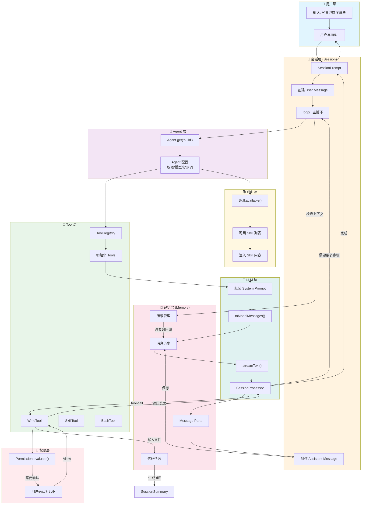
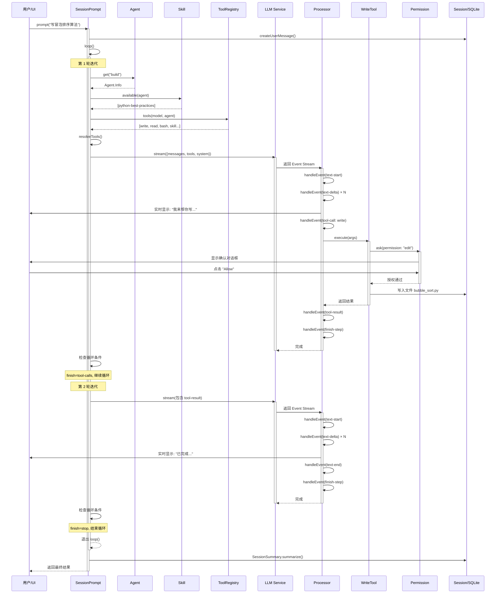
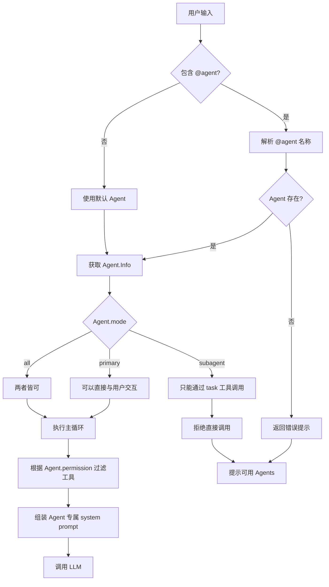
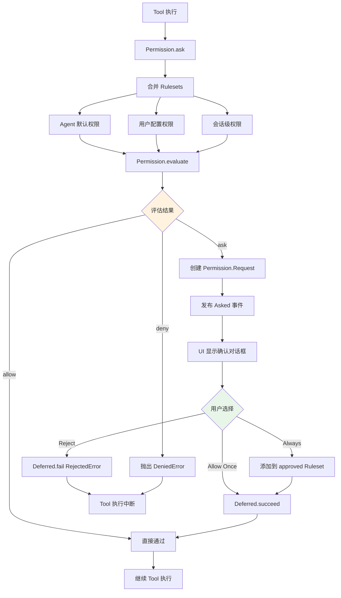

# 任务执行流程图

## 整体架构流程图



---

## 详细执行时序图



---

## Skill 使用流程图

```mermaid
flowchart LR
    A[用户输入] --> B{是否需要 Skill?}
    B -->|是| C[模型调用 skill 工具]
    B -->|否| D[正常处理]
    
    C --> E[SkillTool.execute]
    E --> F[Skill.get(name)]
    F --> G{Skill 存在?}
    G -->|否| H[返回错误: Skill 未找到]
    G -->|是| I[Permission.ask]
    I --> J{用户授权?}
    J -->|否| K[抛出拒绝错误]
    J -->|是| L[读取 SKILL.md]
    L --> M[扫描辅助文件]
    M --> N[组装 skill_content]
    N --> O[返回给模型]
    O --> P[模型使用 Skill 知识]
    
    D --> Q[直接生成回复]
    H --> R[模型调整策略]
    K --> R
    P --> S[完成任务]
    Q --> S
```

---

## Agent 调度流程图



---

## 记忆管理流程图

```mermaid
flowchart TD
    subgraph Incoming["新消息到达"]
        A[添加 Message/Part]
    end
    
    subgraph ContextCheck["上下文检查"]
        B{Token 数 > 阈值?}
    end
    
    subgraph Prune["剪枝 Prune"]
        C[从后向前扫描]
        D{累计 > 40k tokens?}
        E[标记旧 tool output 为 compacted]
    end
    
    subgraph Compact["压缩 Compact"]
        F[创建 compaction user message]
        G[调用 compaction Agent]
        H[生成对话摘要]
        I[保存为 summary message]
    end
    
    subgraph Continue["继续对话"]
        J[插入 "Continue..." 提示]
        K[恢复主循环]
    end
    
    A --> B
    B -->|是| C
    B -->|否| L[正常继续]
    
    C --> D
    D -->|否| C
    D -->|是| E
    E --> F
    
    F --> G
    G --> H
    H --> I
    I --> J
    J --> K
    
    style Prune fill:#fff3e0
    style Compact fill:#e8f5e9
```

---

## 权限检查流程图


