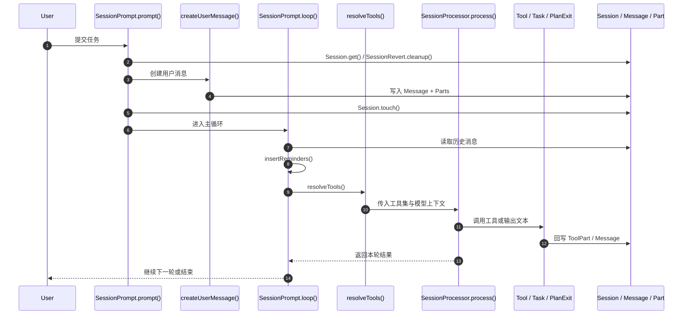
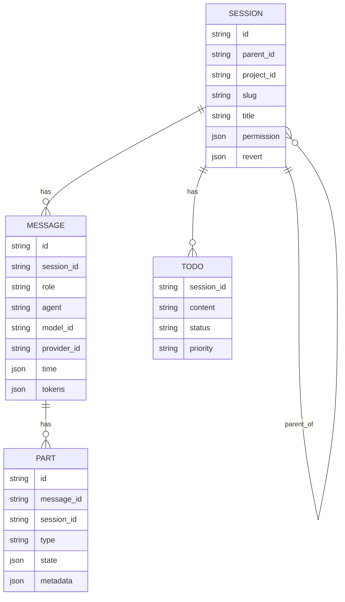
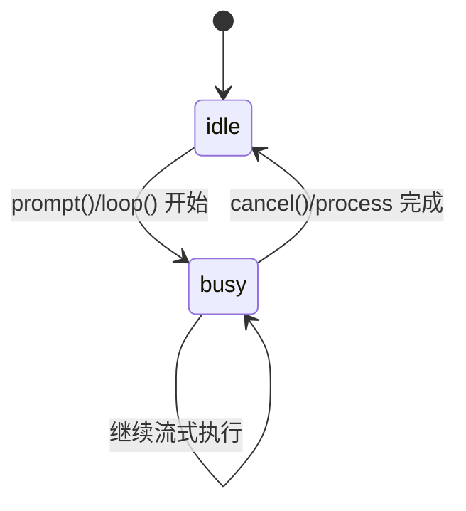
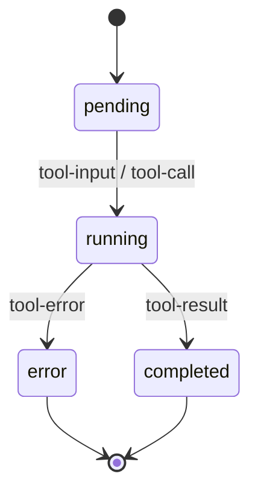
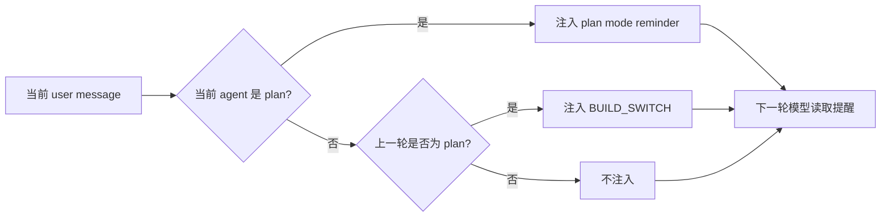
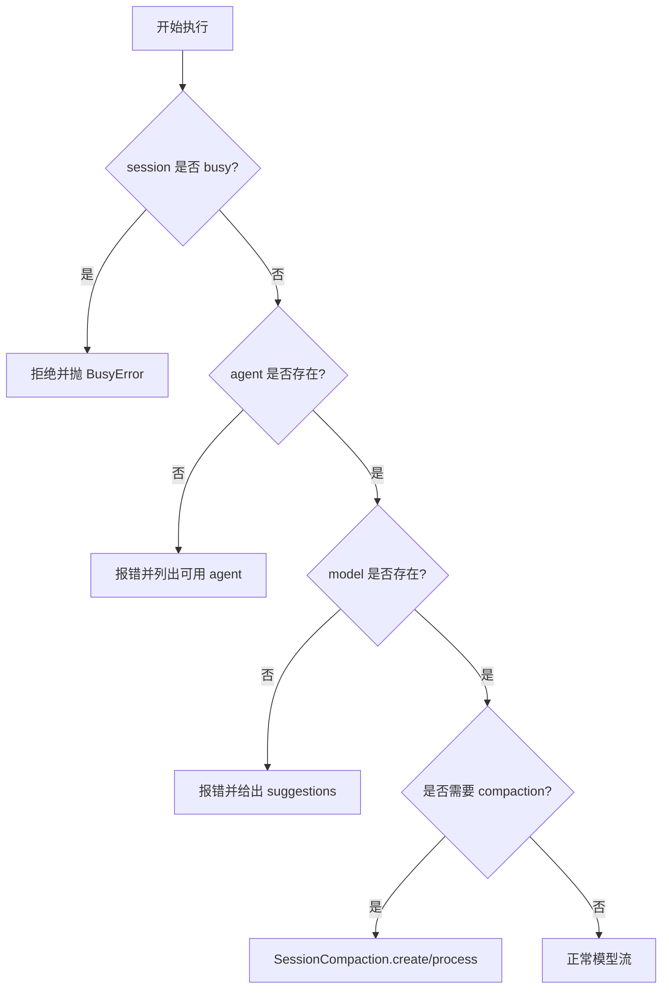

# 图解版：Plan / Build 任务链路

本文是 `docs/requirements-and-architecture-plan-build.md` 的图解补充版，侧重用 Mermaid 把 OpenCode 的执行路径、状态切换、子任务树和数据关系画出来。

重点文件：

- `packages/opencode/src/session/prompt.ts`
- `packages/opencode/src/tool/plan.ts`
- `packages/opencode/src/tool/task.ts`
- `packages/opencode/src/session/system.ts`
- `packages/opencode/src/agent/agent.ts`
- `packages/opencode/src/session/message-v2.ts`
- `packages/opencode/src/session/index.ts`
- `packages/opencode/src/session/session.sql.ts`
- `packages/opencode/src/session/todo.ts`

---

## 1. 图例说明

### 1.1 核心对象

- `Session`：一次会话的根容器。
- `Message`：会话中的一轮消息。
- `Part`：消息中的分片内容。
- `Agent`：处理消息的角色。
- `Tool`：模型可调用的工具。
- `Todo`：计划阶段和长任务中的待办状态。

### 1.2 核心状态

- `SessionStatus`: `busy` / `idle`
- `ToolState`: `pending` / `running` / `completed` / `error`
- `Agent mode`: `primary` / `subagent` / `all`

---

## 2. 主执行流程图

这个图展示的是：用户输入进入会话后，如何一路走到模型执行和工具回写。



### 2.1 读图说明

- `prompt()` 是入口。
- `createUserMessage()` 负责把输入变成结构化消息。
- `loop()` 是真正的调度器。
- `resolveTools()` 决定模型本轮能用哪些工具。
- `SessionProcessor.process()` 处理流式输出、工具调用和收尾。

---

## 3. 计划模式到构建模式切换图

这个图展示 plan 阶段如何结束，并切换到 build 阶段。

```mermaid
flowchart TD
    A[用户进入 plan agent] --> B[insertReminders() 注入 plan 提醒]
    B --> C[模型只读探索 / 写 plan 文件]
    C --> D[PlanExitTool.execute()]
    D --> E[Session.plan(session) 计算 plan 文件路径]
    E --> F[Question.ask() 询问是否切换到 build]
    F -->|No| G[保留 plan 状态 / 继续完善计划]
    F -->|Yes| H[读取最后模型 getLastModel()]
    H --> I[写入新的 user 消息 agent=build]
    I --> J[进入 build 阶段 loop()]
    J --> K[执行计划 / 修改代码 / 跑测试]
```

### 3.1 读图说明

- `plan` 阶段的核心约束是“先设计后执行”。
- 真正切换点不是一个全局变量，而是 `PlanExitTool.execute()` 写入了新的 build user message。
- 用户拒绝切换时，流程不会进入 build。

---

## 4. 子任务树流程图

这个图展示 `task` 工具如何把任务拆成子会话。

```mermaid
flowchart TD
    R[Root Session / build Agent] --> T[TaskTool.execute()]
    T --> A{subagent_type 是否存在}
    A -->|是| B[Agent.get(subagent_type)]
    A -->|否| X[报错]
    B --> C{task_id 是否存在}
    C -->|是| D[Session.get(task_id) 恢复子会话]
    C -->|否| E[Session.create() 新建子会话]
    D --> F[继承父会话上下文与权限]
    E --> F
    F --> G[子会话执行 prompt()]
    G --> H[子 agent 运行 / 调用工具 / 生成结果]
    H --> I[结果写回父会话 ToolPart]
    I --> R
```

### 4.1 读图说明

- `task` 的本质是把局部工作交给子会话。
- `task_id` 允许恢复之前的子会话。
- 子会话不是独立系统，而是父会话树上的一个分支节点。

---

## 5. 数据结构关系图

这个图用于理解会话、消息、part 和 todo 的数据库关系。



### 5.1 读图说明

- `SESSION.parent_id` 形成树形会话结构。
- `MESSAGE.session_id` 归属某个会话。
- `PART.message_id` 归属某条消息。
- `TODO.session_id` 归属某条会话的任务列表。

---

## 6. 状态机图

### 6.1 会话忙碌状态



### 6.2 工具调用状态



### 6.3 读图说明

- `busy/idle` 表示整个 session 是否在跑主循环。
- `pending/running/completed/error` 表示单次工具调用的生命周期。

---

## 7. 计划文件与提醒注入图

这个图适合解释 `insertReminders()` 是怎么把 plan/build 语义写进消息里的。



### 7.1 读图说明

- 计划模式提醒不是外部单独状态，而是直接进入消息内容。
- build 切换也通过提醒文本驱动语义变化。

---

## 8. 系统提示与 agent 选择图

```mermaid
flowchart TD
    A[当前 agent] --> B[Agent.get(name)]
    B --> C{agent 是否存在}
    C -->|否| X[报错并列出可用 agent]
    C -->|是| D[SystemPrompt.environment(model)]
    D --> E[SystemPrompt.skills(agent)]
    E --> F[SystemPrompt.provider(model)]
    F --> G[拼接最终 system prompt]
    G --> H[LLM.stream()]
```

### 8.1 读图说明

- `agent` 决定角色。
- `system` 决定当前模型看到的基础上下文。
- `skills` 和环境信息会影响 plan / build 的具体行为。

---

## 9. 源码跳转图

这个图强调函数之间的跳转顺序。

```mermaid
flowchart TD
    A[SessionPrompt.prompt()] --> B[createUserMessage()]
    B --> C[resolvePromptParts()]
    A --> D[loop()]
    D --> E[insertReminders()]
    D --> F[resolveTools()]
    F --> G[SessionProcessor.process()]
    D --> H[PlanExitTool.execute()]
    D --> I[TaskTool.execute()]
    D --> J[SessionCompaction.process()]
```

### 9.1 读图说明

- `prompt()` 负责入口。
- `loop()` 是总调度器。
- `PlanExitTool` 和 `TaskTool` 是两条最重要的分支。

---

## 10. 边界条件图



### 10.1 读图说明

- 这张图帮助理解为什么系统会提前失败，而不是继续执行。
- 所有边界都是为了保持主循环稳定。

---

## 11. 怎么把这些图和源码对应起来

- 想看入口：看 `session/prompt.ts`。
- 想看计划切换：看 `tool/plan.ts` 和 `insertReminders()`。
- 想看子任务：看 `tool/task.ts`。
- 想看系统提示：看 `session/system.ts`。
- 想看消息结构：看 `session/message-v2.ts`。
- 想看数据库关系：看 `session/session.sql.ts`。
- 想看 todo 状态：看 `session/todo.ts`。

---

## 12. 结论

图解版的重点不是把所有细节塞进一张图，而是把 OpenCode 的核心链路拆成几类稳定视图：

- 主执行流
- plan/build 切换流
- task 子会话树
- 数据结构关系
- 状态机
- 边界条件

这样既适合快速理解，也适合后续在源码级文档里回查对应函数。

