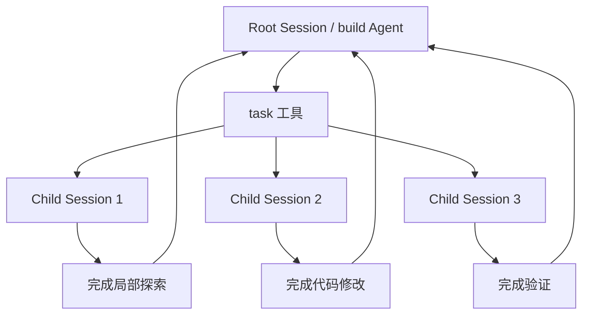
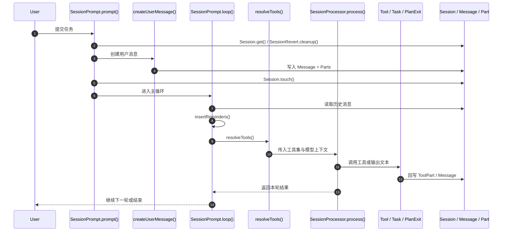
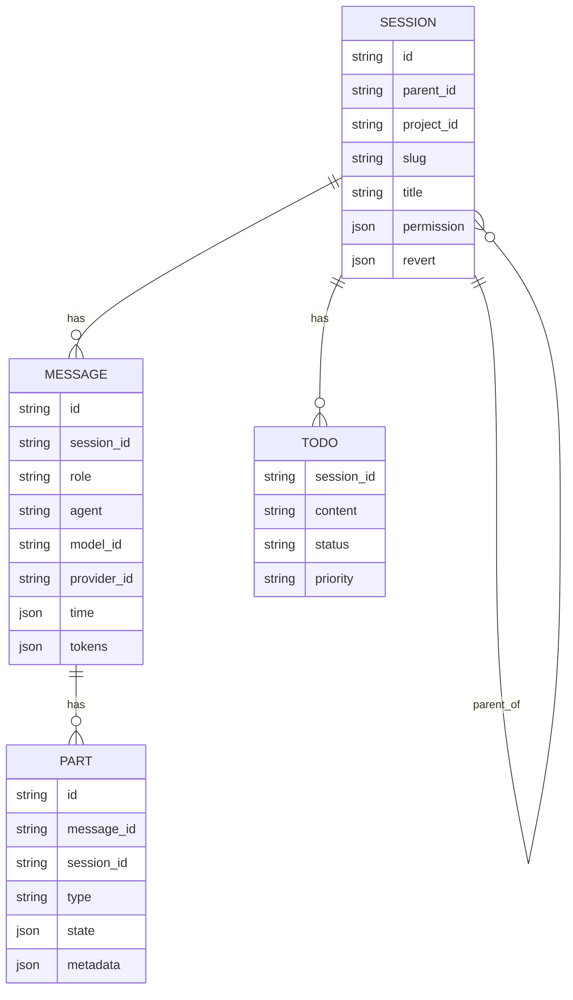
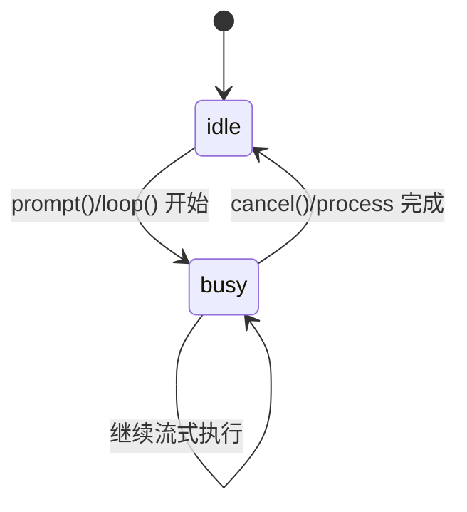
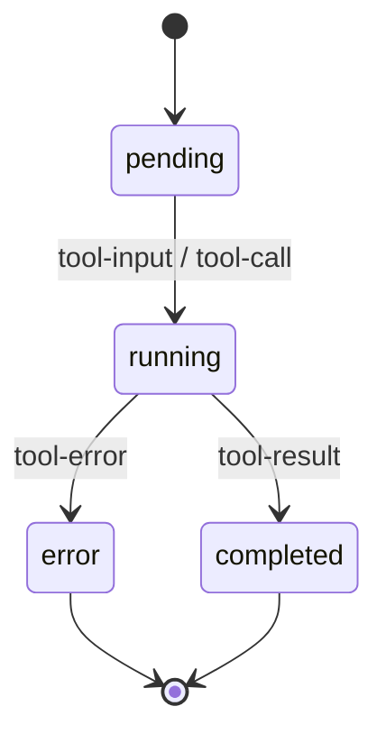
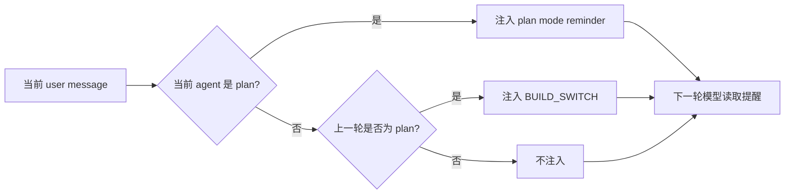
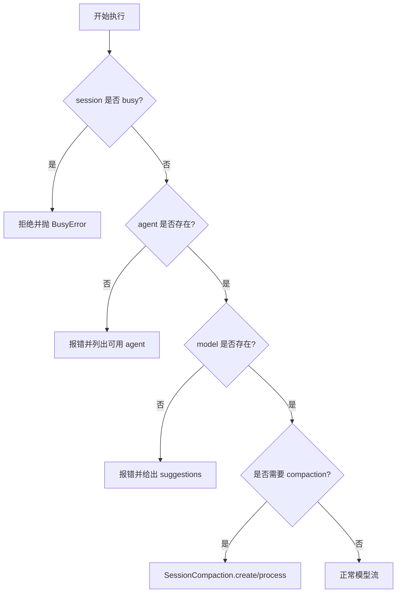

# 需求分析与架构设计：Plan / Build 任务链路

本文档详细说明 OpenCode 在“任务开始时先进行架构设计”的真实实现方式，并作为本主题的**总集入口**。它既保留了总览，也合并了逐函数说明与图解流程，便于直接按源码阅读。

- 需求分析
- 架构设计方案
- 核心数据结构
- 函数跳转流程
- 计划模式与构建模式的切换
- `task` 子智能体分发机制
- Mermaid 流程图

涉及的关键代码文件：

- `packages/opencode/src/session/prompt.ts`
- `packages/opencode/src/tool/plan.ts`
- `packages/opencode/src/tool/task.ts`
- `packages/opencode/src/agent/agent.ts`
- `packages/opencode/src/session/system.ts`
- `packages/opencode/src/session/message-v2.ts`
- `packages/opencode/src/session/index.ts`
- `packages/opencode/src/session/session.sql.ts`
- `packages/opencode/src/session/todo.ts`

如果你想先看更偏源码注释手册的内容，可以直接跳到 **附录 A**；如果你想先看流程图，可以直接跳到 **附录 B**。下面正文保留总览，然后在末尾合并两份补充文档的核心内容。

---

## 1. 需求分析

### 1.1 用户真实需求
当用户提出一个复杂的编程任务时，系统不应该立刻直接修改代码，而是先进入“架构设计 / 计划阶段”，完成以下目标：

1. 先理解需求。
2. 搜集上下文。
3. 拆分任务。
4. 形成结构化计划。
5. 由用户确认后，再切换到执行阶段。
6. 在执行阶段逐步落地代码并持续验证。

### 1.2 为什么必须先规划
复杂任务往往同时涉及：

- 多个文件
- 多个模块
- 不同工具
- 代码修改顺序依赖
- 回归风险

如果没有先规划，LLM 容易出现：

- 只修改局部，忽略全局影响
- 漏掉边界条件
- 在工具调用之间丢失任务主线
- 过早写代码导致返工

### 1.3 OpenCode 的设计目标
OpenCode 的目标不是“让模型一次性写完”，而是：

- 通过 `plan` agent 先形成架构。
- 通过 `build` agent 再执行实现。
- 通过 `task` 工具把局部工作拆给子会话。
- 通过 `session` 和 `message` 持久化整个过程。
- 通过 `todo`、`summary`、`compaction` 等机制减少遗漏。

---

## 2. 架构设计方案

### 2.1 总体设计思想
OpenCode 的任务执行方式可以理解为一个两阶段流水线：

1. **Plan 阶段**
   - 主要负责理解需求、探索代码库、形成方案。
   - 默认使用 `plan` agent。
   - 强调只读操作，尽量不改代码。
   - 允许写计划文件。

2. **Build 阶段**
   - 主要负责按计划实施代码修改。
   - 默认使用 `build` agent。
   - 允许读写、执行命令、测试验证。
   - 可以调用 `task` 工具把子任务发给子 agent。

### 2.2 角色分工
#### `plan` agent
职责：

- 搜集上下文
- 生成架构设计
- 拆分任务步骤
- 输出计划文件
- 在完成后通过 `plan_exit` 询问是否切换到 `build`

#### `build` agent
职责：

- 按照计划实施代码
- 修改文件
- 运行测试与验证
- 调用子任务完成局部工作
- 必要时继续更新 TODO

### 2.3 计划与执行不是两个独立系统
它们不是两个完全割裂的程序，而是通过同一个会话系统切换：

- 同一套 `Session`
- 同一套 `Message`
- 同一套 `Tool` 机制
- 通过 `agent` 字段和系统提醒切换语义

换句话说：

> “计划”和“执行”是同一条会话流里的不同阶段，而不是两个不同应用。

### 2.4 架构设计来源
架构设计并不是完全硬编码在 Skill 里，也不是完全由 LLM 盲写。实际是三者结合：

1. **System Prompt / Skill** 提供约束。
2. **代码库上下文** 提供真实现状。
3. **LLM 推理** 负责生成任务拆解与设计方案。

其中，`packages/opencode/src/session/system.ts` 会负责把环境信息与 skills 内容拼接进系统提示词。

---

## 3. 核心数据结构

### 3.1 `Agent.Info`
文件：`packages/opencode/src/agent/agent.ts`

核心字段：

- `name`：agent 名称，如 `plan`、`build`
- `mode`：`primary` / `subagent` / `all`
- `permission`：权限规则集
- `model`：可选的模型覆盖
- `prompt`：可选的角色提示词
- `options`：模型选项
- `steps`：最大步数限制

这个结构决定了 agent 能做什么、不能做什么。

### 3.2 `Session.Info`
文件：`packages/opencode/src/session/index.ts`

常见字段：

- `id`
- `parentID`
- `slug`
- `directory`
- `title`
- `permission`
- `time`
- `revert`

它是整个任务树的根状态容器。

### 3.3 `MessageV2.User` / `MessageV2.Assistant`
文件：`packages/opencode/src/session/message-v2.ts`

用户消息包含：

- `role`
- `agent`
- `model`
- `system`
- `format`
- `variant`
- `tools`
- `parts`

助手消息包含：

- `role`
- `agent`
- `mode`
- `path`
- `tokens`
- `finish`
- `error`

模式切换本质上就是：

- 写入新 `user` 消息
- 给它指定 `agent: "plan"` 或 `agent: "build"`
- 继续进入同一个 loop

### 3.4 `MessageV2.ToolPart`
工具调用部分保存：

- `tool`
- `callID`
- `state.status`
- `state.input`
- `state.output`
- `state.error`
- `time`

它用于记录一次工具调用的完整生命周期。

### 3.5 `Session.Table`
文件：`packages/opencode/src/session/session.sql.ts`

关键字段：

- `parent_id`：体现子会话树结构
- `permission`：会话级权限
- `summary_*`：摘要统计
- `revert`：回滚记录
- `time_compacting` / `time_archived`：会话生命周期控制

### 3.6 `Todo.Info`
文件：`packages/opencode/src/session/todo.ts`

字段：

- `content`
- `status`
- `priority`

用于记录多步骤任务的待办状态，避免遗漏。

---

## 4. 函数跳转流程

### 4.1 主入口：`SessionPrompt.prompt()`
文件：`packages/opencode/src/session/prompt.ts`

入口步骤：

1. 读取当前 session。
2. 清理 revert 状态。
3. 调用 `createUserMessage()` 生成用户消息。
4. 调用 `Session.touch()` 更新活跃时间。
5. 如果用户输入了 `tools`，则回写 permission。
6. 如果 `noReply` 为真，直接结束。
7. 否则进入 `loop()`。

### 4.2 创建消息：`createUserMessage()`
这个函数负责：

- 解析 agent
- 解析 model
- 组织输入 parts
- 处理文件、目录、MCP 资源、agent mention
- 持久化 `MessageV2.User`
- 持久化每个 part

它是把“用户自然语言”转成“可供模型消费的结构化消息”的关键入口。

### 4.3 主循环：`loop()`
`loop()` 是整个任务流的核心调度器。

它会：

1. 读取会话历史。
2. 找到最后的 user / assistant 消息。
3. 处理 compaction / subtask / normal response。
4. 调用 `insertReminders()` 注入模式提醒。
5. 构建工具集 `resolveTools()`。
6. 创建 `SessionProcessor`。
7. 调用 `processor.process()` 执行模型流。
8. 根据结果决定继续、压缩、停止。

### 4.4 模式提醒：`insertReminders()`
这是 plan/build 切换的关键函数。

- 当当前 agent 是 `plan` 时，注入 plan 模式的系统提醒。
- 当从 `plan` 切换到 `build` 时，注入 build switch 提醒。
- 在实验性 plan 模式下，它还会强调：
  - 只能写计划文件
  - 不能执行非只读工具
  - 必须逐步推进

### 4.5 工具构建：`resolveTools()`
这个函数会把可用工具统一包装成 AI SDK 工具：

- `ToolRegistry.tools()` 提供内置工具
- `MCP.tools()` 提供 MCP 工具
- `SessionProcessor` 提供 tool 执行上下文

它同时负责：

- 权限判断
- 事件钩子
- 参数 schema 转换
- 输出截断与附件处理

### 4.6 退出计划：`PlanExitTool.execute()`
文件：`packages/opencode/src/tool/plan.ts`

逻辑：

1. 读取当前 session。
2. 计算 plan 文件路径。
3. 弹出确认问题。
4. 用户确认后，读取最后一个模型。
5. 构造一条新的 user message。
6. 把 agent 切到 `build`。
7. 进入下一轮执行。

这是 plan -> build 的正式切换点。

### 4.7 子任务分发：`TaskTool.execute()`
文件：`packages/opencode/src/tool/task.ts`

逻辑：

1. 检查权限。
2. 获取目标子 agent。
3. 创建或恢复子 session。
4. 继承父 session 的上下文。
5. 限制子 agent 的递归任务能力。
6. 运行子任务。
7. 把结果写回父会话。

这是“把复杂任务拆成树”的关键机制。

---

## 5. 设计方案细节

### 5.1 先规划后实现
推荐的任务执行顺序：

1. `plan` agent 先做架构设计。
2. 通过 `task` 把探索任务拆给子智能体。
3. 汇总得到计划文件。
4. 用户确认后切换到 `build`。
5. `build` agent 按计划实施。
6. 每步修改后做验证。

### 5.2 如何保证不遗漏
通过以下机制组合保证：

- `Todo` 状态追踪
- `SessionSummary` 概览摘要
- `SessionCompaction` 上下文压缩
- 子会话隔离
- `permission` 约束
- `plan` / `build` 模式切换提醒

### 5.3 架构设计是不是由 Skill 写死
不是。

更准确的说法是：

- Skill 提供“规范与约束”
- LLM 结合实际代码库来生成架构方案
- 系统通过 `prompt.ts`、`system.ts` 把这些约束注入模型上下文

因此，设计方案是“约束下的动态生成”，不是纯手工硬编码，也不是完全自由发挥。

---

## 6. Mermaid 流程图

### 6.1 总流程图

```mermaid
flowchart TD
  A[用户提交复杂任务] --> B[SessionPrompt.prompt()]
  B --> C[createUserMessage()]
  C --> D[Session.touch()]
  D --> E[进入 loop()]
  E --> F[insertReminders()]
  F --> G[resolveTools()]
  G --> H[SessionProcessor.process()]
  H --> I{当前是否需要子任务?}
  I -->|是| J[TaskTool.execute()]
  J --> K[创建/恢复 child session]
  K --> L[子 agent 执行]
  L --> E
  I -->|否| M{是否处于 plan 退出流程?}
  M -->|是| N[PlanExitTool.execute()]
  N --> O[Question.ask() 确认切换]
  O -->|Yes| P[写入 build 用户消息]
  P --> E
  O -->|No| Q[保持 plan 状态]
  M -->|否| R[继续正常模型流]
```

### 6.2 Plan / Build 切换图

```mermaid
flowchart LR
  P1[agent = plan] --> P2[插入 plan mode reminder]
  P2 --> P3[只读探索 / 写计划文件]
  P3 --> P4[PlanExitTool.ask()]
  P4 -->|用户确认| B1[agent = build]
  B1 --> B2[执行计划]
  B2 --> B3[修改代码 / 跑测试 / 修复]
```

### 6.3 子任务树图



---

## 7. 边界条件与限制

### 7.1 计划阶段不是绝对静态
计划阶段强调只读，但并不是简单的“禁用一切”。
它仍然允许：

- 读文件
- 搜索代码
- 调用探索工具
- 写计划文件

### 7.2 `task` 会受到权限控制
子任务是否允许调用 `task`、`todowrite` 等工具，会受到 agent 权限规则影响。

### 7.3 模式切换依赖消息语义
当前实现并不是依赖一个单独的全局 mode 变量，而是通过：

- `user message.agent`
- `assistant message.agent`
- 系统提醒文本
- session history

共同塑造阶段语义。

### 7.4 `build` 并不是“无约束执行”
它仍然受到：

- session permission
- agent permission
- tool permission
- model capability

等约束。

---

## 8. 结论

OpenCode 的“先规划、后执行”体系，是一个由 `session`、`message`、`agent`、`tool` 共同组成的状态机：

- `plan` 负责理解和设计
- `build` 负责实现和验证
- `task` 负责拆分子任务
- `SessionPrompt` 负责驱动整体循环
- `SessionProcessor` 负责流式工具生命周期

这套设计的关键不是单点逻辑，而是**把任务树、消息树、工具树统一纳入同一个会话流中管理**。

---

## 附录 A：源码级逐函数说明总集

这一部分把 `source-walkthrough` 的内容并回主文档，按“入口 → 构建消息 → 主循环 → 计划切换 → 子任务 → 系统提示与数据结构”的顺序展开。它更像源码注释手册：每个函数都给出职责、跳转路径和边界条件。

### A.1 `packages/opencode/src/session/prompt.ts`

#### `SessionPrompt.prompt(input)`

- 入口：处理用户输入并启动会话。
- 上游：`Session.get()`、`SessionRevert.cleanup()`、`createUserMessage()`。
- 下游：`Session.touch()`、`loop()`。
- 关键点：如果 `noReply` 为真，则只写消息不进入循环；如果旧式 `tools` 传入，则先折算成权限。

#### `SessionPrompt.assertNotBusy(sessionID)`

- 作用：防止同一 session 同时被两个主循环占用。
- 结果：若已经 busy，则抛 `Session.BusyError`。

#### `SessionPrompt.cancel(sessionID)`

- 作用：中止当前 session、清理 abort controller、恢复 `idle`。
- 常见场景：用户手动停止、shell/工具结束后收尾、恢复前清理旧状态。

#### `createUserMessage(input)`

- 作用：把自然语言与 parts 规范化为 `MessageV2.User` 和一组 `MessageV2.Part`。
- 跳转：`Agent.get()`、`Provider.getModel()`、`resolvePromptParts()`、`Session.updateMessage()`、`Session.updatePart()`。
- 分支：`file`、`directory`、`MCP resource`、`agent mention`、普通文本。
- 边界：缺 agent、缺文件、MCP 读取失败都会转为可见错误消息。

#### `resolvePromptParts(template)`

- 作用：把模板中的文件引用和 agent 引用转成结构化 parts。
- 跳转：`ConfigMarkdown.files()`、`fs.stat()`、`Agent.get()`。
- 边界：同名引用去重；`~/` 会展开；目录会转为目录型 file part。

#### `loop(input)`

- 作用：主调度器，负责回放历史、决定是否压缩、是否进入子任务、是否继续正常生成。
- 跳转：`MessageV2.stream()`、`insertReminders()`、`resolveTools()`、`SessionProcessor.create()`、`processor.process()`。
- 关键状态：`lastUser`、`lastAssistant`、`lastFinished`、`tasks`、`SessionStatus`。
- 边界：找不到 user message 直接失败；模型不存在广播错误；上下文溢出转 compaction。

#### `insertReminders(input)`

- 作用：把 plan/build 的语义直接写入 user message parts。
- plan 阶段：注入只读/计划文件提醒。
- build 阶段：注入 `BUILD_SWITCH`，提醒按照已有计划执行。
- 边界：plan 文件不存在时只提示路径；该逻辑是消息层语义切换，不是单独模式变量。

#### `resolveTools(input)`

- 作用：组装 AI SDK 的工具集。
- 跳转：`ToolRegistry.tools()`、`MCP.tools()`、`Permission.ask()`、`SessionProcessor.partFromToolCall()`。
- 关键职责：权限过滤、schema 转换、插件钩子、附件收拢、输出截断。

#### `createStructuredOutputTool(input)`

- 作用：当用户要求 JSON schema 输出时，把结构化输出捕获到外部状态。
- 边界：如果模型没调用该工具，后续会生成结构化输出错误。

#### `SessionPrompt.command(input)`

- 作用：命令系统入口，负责把 command 模板、参数占位符和 prompt parts 串起来。
- 跳转：`Command.get()`、`resolvePromptParts()`、`prompt()`。
- 分支：command 不存在、model 不存在、agent 不存在都会报错。

#### `SessionPrompt.shell(input)`

- 作用：直接执行 shell 命令并记录成会话中的 tool part。
- 跳转：`Shell.preferred()`、`spawn()`、`Session.updateMessage()`、`Session.updatePart()`。
- 边界：会被 abort；退出后恢复 loop；输出会累计到 tool metadata。

### A.2 `packages/opencode/src/tool/plan.ts`

#### `PlanExitTool.execute()`

- 作用：计划阶段结束后的显式出口。
- 跳转：`Session.get()` → `Session.plan(session)` → `Question.ask()` → `getLastModel()` → 写入新的 build user message。
- 边界：用户选 No 就保持 plan 状态；选 Yes 才切到 build。
- 语义：这里不是简单修改一个 mode 字段，而是通过新 user message 驱动下一个 loop。

### A.3 `packages/opencode/src/tool/task.ts`

#### `TaskTool.execute()`

- 作用：把一个子任务分发给子 agent 和子 session。
- 跳转：`Agent.get()`、`Session.get(task_id)` 或 `Session.create()`、`SessionPrompt.prompt()`。
- 关键控制：权限校验、递归防护、父会话/子会话上下文继承、结果回写。
- 边界：子 agent 不存在、权限不够、恢复失败都会落成显式错误。

### A.4 `packages/opencode/src/session/system.ts` 与 `packages/opencode/src/agent/agent.ts`

#### `SystemPrompt.environment(model)` / `SystemPrompt.skills(agent)` / `SystemPrompt.provider(model)`

- 作用：拼接基础运行环境、skills 和 provider 特性。
- 结果：形成每轮模型调用之前的 system prompt 组装层。

#### `Agent.Info` / `Agent.get()` / `Agent.list()` / `Agent.defaultAgent()`

- 作用：定义 agent 能力边界，并提供获取与默认选择。
- 关键字段：`mode`、`permission`、`model`、`prompt`、`steps`。

### A.5 `packages/opencode/src/session/message-v2.ts`

#### `MessageV2.Info` / `MessageV2.Part`

- 作用：定义消息和 part 的结构化 schema。

#### `MessageV2.toModelMessages()`

- 作用：把内部消息转换成模型可消费格式。
- 意义：这是 prompt 喂给 LLM 前的最后一层结构转换。

#### `MessageV2.stream(sessionID)` / `MessageV2.filterCompacted()`

- 作用：按会话读取消息历史，并过滤压缩后的片段。
- 意义：主循环和恢复逻辑都依赖它回放历史状态。

### A.6 `packages/opencode/src/session/index.ts`

#### 公开入口

- `Session.get()`
- `Session.create()`
- `Session.updateMessage()`
- `Session.updatePart()`
- `Session.setTitle()`
- `Session.touch()`
- `Session.plan(session)`

#### 作用

- 作为 session 领域的门面，串起 prompt、task、plan、summary、revert 和持久化。

### A.7 `packages/opencode/src/session/session.sql.ts`

#### `SessionTable` / `MessageTable` / `PartTable` / `TodoTable`

- `SessionTable`：保存会话树与生命周期。
- `MessageTable`：保存对话轮次。
- `PartTable`：保存消息分片与工具执行过程。
- `TodoTable`：保存计划和长任务中的待办项。

#### 关键关系

- `parent_id` 形成会话树。
- `session_id` 约束 message/part/todo 归属。

### A.8 `packages/opencode/src/session/todo.ts`

#### `Todo.Info` / `Todo.update()` / `Todo.get()`

- 作用：维护 session 维度的待办清单。
- 更新语义：全量替换而不是增量 patch，保证顺序稳定。
- 价值：降低长任务遗漏风险。

### A.9 源码级函数跳转总表

- `SessionPrompt.prompt()` → `createUserMessage()` → `Session.touch()` → `loop()`
- `loop()` → `insertReminders()` → `resolveTools()` → `SessionProcessor.process()`
- `loop()` → `PlanExitTool.execute()` → `Question.ask()` → build user message
- `loop()` → `TaskTool.execute()` → child session → 子 `prompt()`
- `loop()` → `SessionCompaction.process()` / `SessionCompaction.create()`
- `createUserMessage()` → `resolvePromptParts()` → `Session.updateMessage()` / `Session.updatePart()`

---

## 附录 B：图解版流程图总集

这一部分把 `flowcharts` 的内容并回主文档，用 Mermaid 直接描述主链路、切换流、子会话树、数据关系和状态机。

### B.1 主执行流程图



### B.2 计划模式到构建模式切换图

```mermaid
flowchart TD
    A[用户进入 plan agent] --> B[insertReminders() 注入 plan 提醒]
    B --> C[模型只读探索 / 写 plan 文件]
    C --> D[PlanExitTool.execute()]
    D --> E[Session.plan(session) 计算 plan 文件路径]
    E --> F[Question.ask() 询问是否切换到 build]
    F -->|No| G[保留 plan 状态 / 继续完善计划]
    F -->|Yes| H[读取最后模型 getLastModel()]
    H --> I[写入新的 user 消息 agent=build]
    I --> J[进入 build 阶段 loop()]
    J --> K[执行计划 / 修改代码 / 跑测试]
```

### B.3 子任务树流程图

```mermaid
flowchart TD
    R[Root Session / build Agent] --> T[TaskTool.execute()]
    T --> A{subagent_type 是否存在}
    A -->|是| B[Agent.get(subagent_type)]
    A -->|否| X[报错]
    B --> C{task_id 是否存在}
    C -->|是| D[Session.get(task_id) 恢复子会话]
    C -->|否| E[Session.create() 新建子会话]
    D --> F[继承父会话上下文与权限]
    E --> F
    F --> G[子会话执行 prompt()]
    G --> H[子 agent 运行 / 调用工具 / 生成结果]
    H --> I[结果写回父会话 ToolPart]
    I --> R
```

### B.4 数据结构关系图



### B.5 状态机图





### B.6 计划提醒注入图



### B.7 系统提示与 agent 选择图

```mermaid
flowchart TD
    A[当前 agent] --> B[Agent.get(name)]
    B --> C{agent 是否存在}
    C -->|否| X[报错并列出可用 agent]
    C -->|是| D[SystemPrompt.environment(model)]
    D --> E[SystemPrompt.skills(agent)]
    E --> F[SystemPrompt.provider(model)]
    F --> G[拼接最终 system prompt]
    G --> H[LLM.stream()]
```

### B.8 源码跳转图

```mermaid
flowchart TD
    A[SessionPrompt.prompt()] --> B[createUserMessage()]
    B --> C[resolvePromptParts()]
    A --> D[loop()]
    D --> E[insertReminders()]
    D --> F[resolveTools()]
    F --> G[SessionProcessor.process()]
    D --> H[PlanExitTool.execute()]
    D --> I[TaskTool.execute()]
    D --> J[SessionCompaction.process()]
```

### B.9 边界条件图



---

## 附录 C：继续阅读建议

- 如果你想从实现入口理解，请先读 `附录 A.1` 的 `SessionPrompt.prompt()` 和 `loop()`。
- 如果你想快速理解整条链路，请先看 `附录 B.1` 和 `附录 B.2`。
- 如果你要回到源码定位，请直接按各小节给出的文件路径跳转。

