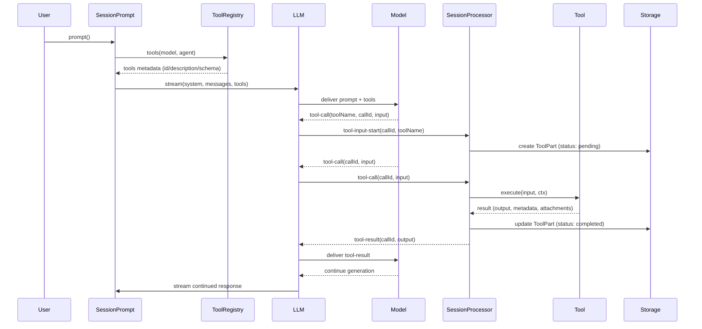

# Tool 生命周期（全交换示例）

说明：本页面描述 OpenCode 中 Tool 的完整生命周期 —— 从工具在代码中定义并注册，到服务端把工具元数据暴露给 LLM，LLM 发起工具调用（tool-call），服务端执行工具、返回结果（tool-result），以及最终把结果注入会话历史并返回给模型的全过程。

简要接收与计划

- 目标：把完整事件序列、关键代码路径与示例对话写成文档并保存到 `docs/tool-lifecycle.md`。
- 输出：一篇可读的 Markdown 文档，包含 ASCII 流程图、事件序列、示例对话（tool-call / tool-result）与代码引用。

检查清单

- [x] 高层 ASCII 流程图
- [x] 事件序列（精确事件名）与对应处理动作
- [x] 示例对话与工具调用 payload + 结果
- [x] 权限/安全/实现注意事项清单
- [x] 代码阅读引导（关键文件与函数）

---

## 高层流程（ASCII 图）

Tool 定义/实现 (code) -> ToolRegistry.register/init -> ToolRegistry.tools -> SessionPrompt.resolveTools -> LLM.stream (tools 参数) -> 模型在推理中决定调用工具 -> AI SDK 产生 tool-input / tool-call 事件 -> SessionProcessor.handleEvent 处理事件 -> 服务端 wrapper 调用 tool.execute -> tool 执行 (ctx.ask 权限检查, IO/修改) -> 返回结果 -> SessionProcessor 接收 tool-result 并更新 ToolPart -> 模型收到 tool-result 并继续推理

简化图（横向）：

User -> SessionPrompt.prompt()
  -> build tools set (ToolRegistry.tools -> resolveTools -> tools map)
  -> LLM.stream(..., tools)
Model ----(tool-call)----> Server (SessionProcessor)
  Server: handle tool-input-start -> create ToolPart(pending)
  Server: handle tool-call -> update ToolPart(running) -> execute tool
  Tool.execute -> ctx.ask (permission) -> perform IO -> return result
  Server -> receive tool-result -> update ToolPart(completed) -> persist
Model <--- tool-result --- Server

---



## 事件序列（代码中的实际事件名）

关键事件（在 `SessionProcessor.handleEvent` 中处理）：

- `tool-input-start`：LLM 开始发送工具参数，服务端创建一个 ToolPart，状态为 `pending`。

示例代码片段（来自 `packages/opencode/src/session/processor.ts`）：

```ts
case "tool-input-start":
  ctx.toolcalls[value.id] = (yield* session.updatePart({
    id: ctx.toolcalls[value.id]?.id ?? PartID.ascending(),
    messageID: ctx.assistantMessage.id,
    sessionID: ctx.assistantMessage.sessionID,
    type: "tool",
    tool: value.toolName,
    callID: value.id,
    state: { status: "pending", input: {}, raw: "" },
  })) as MessageV2.ToolPart
  return
```

- `tool-call`：LLM 提交完整参数并请求执行。服务端把对应 ToolPart 标记为 `running`（记录输入），并触发 doom-loop 检测。

代码片段（同一文件）：

```ts
case "tool-call": {
  const match = ctx.toolcalls[value.toolCallId]
  if (!match) return
  ctx.toolcalls[value.toolCallId] = (yield* session.updatePart({
    ...match,
    tool: value.toolName,
    state: { status: "running", input: value.input, time: { start: Date.now() } },
    metadata: value.providerMetadata,
  })) as MessageV2.ToolPart
  // Doom-loop 检测在这里
  ...
  return
}
```

- `tool-result`：工具执行成功，服务端用返回值更新 ToolPart（状态 `completed`），包含 `output`、`metadata`、`attachments` 等。

```ts
case "tool-result": {
  const match = ctx.toolcalls[value.toolCallId]
  if (!match || match.state.status !== "running") return
  yield* session.updatePart({
    ...match,
    state: {
      status: "completed",
      input: value.input ?? match.state.input,
      output: value.output.output,
      metadata: value.output.metadata,
      title: value.output.title,
      time: { start: match.state.time.start, end: Date.now() },
      attachments: value.output.attachments,
    },
  })
  delete ctx.toolcalls[value.toolCallId]
  return
}
```

- `tool-error`：工具执行失败，更新 ToolPart 为 `error` 并记录错误信息；当错误为权限拒绝时，可能会将处理器 `blocked`。

```ts
case "tool-error": {
  const match = ctx.toolcalls[value.toolCallId]
  if (!match || match.state.status !== "running") return
  yield* session.updatePart({
    ...match,
    state: {
      status: "error",
      input: value.input ?? match.state.input,
      error: value.error instanceof Error ? value.error.message : String(value.error),
      time: { start: match.state.time.start, end: Date.now() },
    },
  })
  if (value.error instanceof Permission.RejectedError || value.error instanceof Question.RejectedError) {
    ctx.blocked = ctx.shouldBreak
  }
  delete ctx.toolcalls[value.toolCallId]
  return
}
```

相关补充事件（与工具调用并行）：
- `text-start` / `text-delta` / `text-end`：模型产生文本时的增量事件。工具调用期间这些也可能交错发生。
- `start-step` / `finish-step`：对于一次 LLM 调用的开始/结束标记，会和 snapshot/patch 计算、token 统计、message.finish 更新等联动。

---

## 工具从注册到暴露给 LLM（代码路径）

1. 定义工具：在代码中使用 `Tool.define(...)`（`packages/opencode/src/tool/tool.ts` 定义了工具 contract 与 `define` 包装）。
2. 聚合与注册：`ToolRegistry` 汇集内置工具、配置目录里的自定义工具、以及插件工具。
   - 关键函数：`ToolRegistry.tools(model, agent)`（文件：`packages/opencode/src/tool/registry.ts`），它会：
     - 调用 `all()` 列出所有可用工具（基于 Flag/配置决定启用哪些）。
     - 根据模型/provider 做过滤（例如 `apply_patch`、`edit`/`write` 的互斥逻辑）。
     - 并行调用每个工具的 `init({ agent })`，收集 `description` 与 `parameters`，并触发 `plugin.trigger("tool.definition")` 让插件可以修改描述/schema。最终返回初始化后的工具数组。

3. 在会话中把 tools 包装成 AI SDK 工具：
   - `SessionPrompt.resolveTools(...)`（文件：`packages/opencode/src/session/prompt.ts`）会：
     - 调用 `ToolRegistry.tools(...)` 得到初始化后的工具定义（数组）。
     - 使用 `tool({ id, description, inputSchema, execute })`（AI SDK）把每项封装为模型可见的工具，并把 `execute` 包装为一个调用 `item.execute(args, ctx)` 的异步函数；包装中还会触发 `plugin` 钩子和格式化输出。
   - 在包装时会生成一个 runtime `context(args, options)`，用于传给工具的 `execute`，这个 `context` 包含：`sessionID, messageID, agent, abort, callID, messages, metadata(), ask()`（prompt.ts lines ~800..835）。其中 `ask()` 会调用 `Permission.ask(...)` 把权限请求向用户/系统询问（并记录 tool 的调用元数据）。

4. LLM 层把 `tools` 传到底层 provider：
   - `LLM.stream(...)`（`packages/opencode/src/session/llm.ts`）在调用 `streamText(...)` 时会把 `tools`、`activeTools`、`toolChoice` 等参数传递入 AI SDK（见 llm.ts `streamText` 调用处）。
   - 有些 provider（如 LiteLLM/Bedrock）要求当消息历史包含 tool 调用但当前没有工具时，注入 `_noop` stub tool（llm.ts 内有相关兼容逻辑）。

---

## 示例：一个完整的对话与事件交换（`bash` 工具为例）

场景：用户在会话中让 agent 运行一个简单命令 `ls -la /tmp`。模型决定使用 `bash` 工具来执行 Shell 命令。

1) 在 prompt 构建阶段，服务端将 `bash` 工具的描述与 schema 传给模型（`LLM.stream` 的 `tools` 参数）。

2) 模型生成一个工具调用（示例工具调用的推理输出） —— 伪 JSON 表示：

```json
{
  "type": "tool-call",
  "toolName": "bash",
  "toolCallId": "abc123",
  "input": { "command": "ls -la /tmp", "description": "List tmp dir" }
}
```

（在部分 provider/SDK 中可能先发 `tool-input-start` / `tool-input-delta` 分片，最后发 `tool-call`）

3) 服务端 (`SessionProcessor`) 收到 `tool-input-start`：创建 ToolPart（pending），并持久化：

- `Session.updatePart` 写入一条类型为 `tool` 的 part，状态 `pending`。

4) 收到 `tool-call`：服务端更新 ToolPart 为 `running` 并记录输入：

- `Session.updatePart(... state: {status: 'running', input: {command: 'ls -la /tmp'}, time: {start: ...}})`

5) prompt.ts 的包装层（resolveTools -> ai-tool wrapper）会被 SDK 调用，实际走到 `item.execute(args, ctx)`。

示例伪代码（包装执行时的关键动作）：

```ts
// 在 resolveTools 中为 item 构造的 wrapper
async execute(args, options) {
  const ctx = context(args, options)
  await Plugin.trigger('tool.execute.before', {...}, {args})
  const result = await item.execute(args, ctx) // 真正调用 BashTool.execute
  await Plugin.trigger('tool.execute.after', {...}, result)
  return result
}
```

6) `BashTool.execute(params, ctx)` 的主要步骤（摘自 `packages/opencode/src/tool/bash.ts`）：

- 解析工作目录与命令语法（Tree-sitter）
- `collect(...)` 扫描命令，收集外部目录和 patterns
- 请求权限：`await ask(ctx, scan)`，该函数会调用：

```ts
await ctx.ask({
  permission: 'external_directory',
  patterns: globs, // 比如 ['/var/*']
  always: globs,
  metadata: {},
})

await ctx.ask({
  permission: 'bash',
  patterns: Array.from(scan.patterns),
  always: Array.from(scan.always),
  metadata: {},
})
```

- 执行命令（`run(...)`）：启动子进程、收集 stdout/stderr、处理超时和中止、并返回 `{ title, metadata, output }`。

7) `item.execute` 返回后，包装层会将结果格式化并返回给 AI SDK，SDK 在流中产生 `tool-result` 事件：

示例 `tool-result` 事件负载（伪 JSON）：

```json
{
  "type": "tool-result",
  "toolCallId": "abc123",
  "input": {"command":"ls -la /tmp"},
  "output": {
    "title": "List tmp dir",
    "output": "total 0\ndrwxrwxrwt  2 root root  60 Apr 16 10:00 tmp",
    "metadata": { "exit": 0 }
  }
}
```

8) `SessionProcessor` 收到 `tool-result`，把对应的 ToolPart 更新为 `completed` 并写入 `output` / `metadata` / `attachments`（见上文代码片段）。随后，LLM 的流继续，模型会在后续生成中看到工具返回的内容（作为消息历史的一部分）。

---

## 权限 / 安全 / 实现注意事项（清单）

- Doom-loop 检测：当模型连续 N 次（默认 3）以相同参数调用同一工具时，`SessionProcessor` 会触发 `doom_loop` 权限询问，防止无限循环（见 `SessionProcessor.DOOM_LOOP_THRESHOLD` 与 `permission.ask` 调用）。
- ctx.ask：工具执行上下文 `ctx` 提供 `ask()` 方法（包装了 `Permission.ask`），工具应在执行前请求必要权限（例如 `bash` 要求 `external_directory` 和 `bash` 权限）。
- 工具元数据大小控制：在 `ToolRegistry`、`Tool.define` 与 `Truncate.output` 中有截断逻辑，避免把超长描述或输出暴露给模型或 UI。插件也可拦截并修改工具定义。`
- 工具过滤：`ToolRegistry.tools` 会根据模型/Provider/Feature Flags 过滤工具（例如 `apply_patch` 仅在某些 GPT 模型下启用），保证模型只见到安全且兼容的工具集合。
- 权限合并：`Permission.merge(agent.permission, session.permission ?? [])` 用于合并 agent 与会话级的权限规则；工具调用时 `ctx.ask` 会把合并后的 ruleset 传入权限系统。
- 异步并发与持久化：工具调用产生的 ToolPart 会被持久化到消息流，UI / 前端可实时显示状态与输出片段。

---

## 示例快速检查点（QA）

Q: 模型能看到工具的实现吗？

A: 不能。模型只看到工具的 `id`、`description` 与 `inputSchema`（已做 provider/schema 转换与截断），实际执行逻辑在服务器端运行（`item.execute` 指向的 JS/TS 代码）。

Q: 工具太多会把上下文撑爆吗？

A: 服务端会过滤并初始化工具后才把`description / schema` 暴露给模型；同时会通过截断和插件钩子精简文本，避免上限问题。

Q: 工具在被多次调用时如何防护？

A: `SessionProcessor` 的 doom-loop 检测、权限系统与 `ctx.ask` 的交互共同防止滥用或无限循环。

---

## 在代码中阅读这些点（Key files & functions）

- `packages/opencode/src/tool/tool.ts`
  - `Tool.define`：工具契约与包装（参数校验、输出截断）

- `packages/opencode/src/tool/registry.ts`
  - `ToolRegistry.tools(model, agent)`：聚合、过滤并初始化工具定义
  - `ToolRegistry.register` / `ids`

- `packages/opencode/src/session/prompt.ts`
  - `resolveTools(...)`：把 `ToolRegistry.tools()` 的结果包装成 AI SDK 的 tools，构造 `context(args, options)` 并把 `item.execute` 包装进 SDK callable
  - `prompt()` / `loop()`：会话循环入口，整合 tools 与 LLM

- `packages/opencode/src/session/llm.ts`
  - `LLM.stream(input)`：组装 system, messages, provider options，调用 `resolveTools` 并把 `tools`/`activeTools`/`toolChoice` 传给 `streamText(...)`（AI SDK）

- `packages/opencode/src/session/processor.ts`
  - `SessionProcessor.handleEvent`：处理 `tool-input-start` / `tool-call` / `tool-result` / `tool-error` 等事件并持久化 `ToolPart`
  - `DOOM_LOOP_THRESHOLD` 以及 finish-step/cleanup/halt 逻辑

- `packages/opencode/src/tool/bash.ts`（示例工具）
  - `collect()`、`ask()`、`execute()`、`run()`：演示工具如何解析命令、收集权限需要、请求权限并执行命令

---

## 参考（文件列表）

- `packages/opencode/src/tool/registry.ts`
- `packages/opencode/src/session/prompt.ts`
- `packages/opencode/src/session/llm.ts`
- `packages/opencode/src/session/processor.ts`
- `packages/opencode/src/tool/bash.ts`
- `packages/opencode/src/tool/skill.ts` (SkillTool 演示 skill->tool 桥接)
- `packages/opencode/src/tool/tool.ts`

---

如果你需要，我可以：

- 把本文档转成 Mermaid 时序图（`.md` 中嵌入 mermaid）以便渲染；
- 追加另一个示例（例如 `read` 或 `apply_patch`）展示包含附件与 patch 的工具调用；
- 在 docs 中增加一节“调试与日志位置”，教你如何在运行时追踪具体 tool 调用的日志与 Session.Message/Part。 

要我接着把 mermaid 图加入到本文件，还是现在的 ASCII+代码片段足够？

---

## 调试与日志追踪（快速上手）

下面是一些实用的、本地可复现的调试步骤，用来追踪 tool 的初始化、调用和持久化状态（ToolPart）：

1) 启动 CLI/服务并打印日志（开发模式）

```bash
# 在仓库目录下启动 opencode 的 CLI/服务，并把日志打印到 stderr
bun packages/opencode/src/index.ts serve --print-logs --log-level DEBUG
# 或运行你需要的命令（例如 run）并打开 DEBUG 日志
bun packages/opencode/src/index.ts run --print-logs --log-level DEBUG
```

说明：`--print-logs` 会直接把日志打印到 stderr，便于实时观察；`--log-level DEBUG` 打开详细日志（ToolRegistry、SessionProcessor、各 Tool 的日志等）。

2) 如果你不使用 `--print-logs`，可以在运行后查看日志文件位置：

```bash
# 日志文件由 Log.init 创建，默认路径在 Global.Path.log
# 你可以查看最近的日志文件：
ls -1 /path/to/opencode/logs/
tail -f /path/to/opencode/logs/latest.log
```

3) 快速打印某个 session 的消息（包含 ToolPart）

创建并运行脚本来打印会话消息（已提供）：

```bash
cd packages/opencode
bun scripts/print-session-messages.ts <SESSION_ID>
```

脚本位置：`packages/opencode/scripts/print-session-messages.ts`（会调用 `Session.messages({ sessionID })` 并打印每条 message 的 parts）。

4) 关注关键日志与代码位置

- `tool.registry`（`packages/opencode/src/tool/registry.ts`）: 工具聚合、过滤与 init
- `session.prompt`（`packages/opencode/src/session/prompt.ts`）: resolveTools、包装 execute 的 context
- `llm`（`packages/opencode/src/session/llm.ts`）: 将 tools 传给 provider / streamText
- `session.processor`（`packages/opencode/src/session/processor.ts`）: 处理 `tool-input-start/tool-call/tool-result/tool-error`
- 各工具（如 `packages/opencode/src/tool/bash.ts`）: 工具内部的 `log.info(...)` / `Log.create({service: 'bash-tool'})`

5) 查看数据库（可选）

项目使用内部 Database 接口，若需要直接查询，可使用内置 CLI 命令或写临时脚本查询 `MessageV2` 表；更推荐使用上面的 `print-session-messages.ts` 脚本或内置的 `opencode session` CLI 子命令。

6) 调试建议

- 当排查工具调用失败时，先开启 DEBUG 日志并复现问题，观察 `session.processor` 是否记录了 `tool-error`；
- 检查权限请求：工具会通过 `ctx.ask` 调用权限系统（`Permission.ask`），若是权限导致的拒绝，会在日志与 ToolPart 中体现为 error；
- 若工具输出被截断，检查 `Truncate`（`packages/opencode/src/tool/truncate.ts`）写入的截断文件并查看提示；
- 在工具实现处临时添加更详细的 `Log.create(...).debug(...)` 调试语句，注意不要在生产环境泄露敏感内容。

如果你确认，我现在会：
- 创建脚本 `packages/opencode/scripts/print-session-messages.ts`（用于打印会话消息），
- 并演示一次本地的快速复现流程（创建会话 -> 触发简单 tool 调用 -> 使用脚本查看 ToolPart 状态）。

